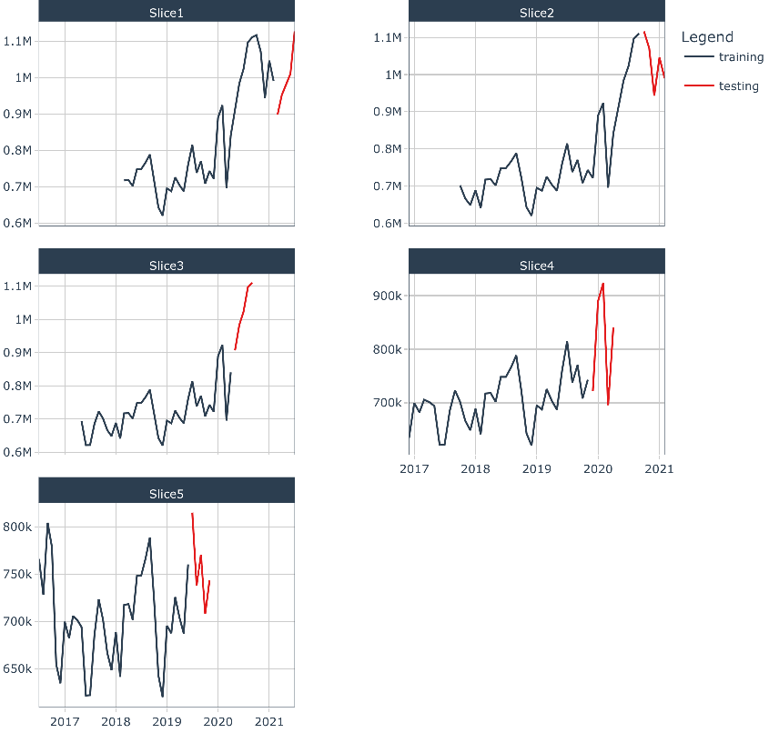

```{r setup, include=FALSE}
options(scipen = 999)
knitr::opts_chunk$set(echo = F, message = F, warning = F, include=FALSE, 
                      #results = F,
                      comment = "",fig.pos = "H",fig.align = "center")
```

```{r paquetes}
# Core
library(tidyverse)
library(grid)
library(gridExtra)

# Load data
library(readxl)

# Time Series
library(timetk)
library(forecast)
library(TSA)
library(NTS)
library(MSwM)
library(tsDyn)
library(fNonlinear)
library(dlm)
library(astsa)
library(seasonal)
library(tseries)
library(astsa)
library(tsoutliers)
library(urca)

# Machine Learning
library(tidymodels)
library(modeltime)
library(modeltime.ensemble)
library(modeltime.resample)

library(timetk)

## Prueba de Tensión
library(evir)
```

```{r FUNCION GETPERFORMANCE}
getPerformance = function(pred, val) {
    res = pred - val
    MAE = sum(abs(res))/length(val)
    RSS = sum(res^2)
    MSE = RSS/length(val)
    RMSE = sqrt(MSE)
    perf = data.frame(MAE, RSS, MSE, RMSE)
    return(perf)
}

#getPerformance(pred, val)
```

# Introducción

La crisis sanitaria por el COVID 19 ha impactado la conducta de los diferentes agentes económicos las cuales son importantes identificar ya que podrían profundizar aún más la crisis económica que se desarrolla actualmente. Este cambio en las conductas se observa desde el primer caso de COVID - 19 en Costa Rica y aún persiste en el 2021, en gran parte debido a la incertidumbre sobre el futuro de la pandemia, en términos de duración y profundidad.

Países como Costa Rica se han visto severamente afectados por esta crisis sanitaria y económica ya que poseen una apertura comercial internacional bastante alta y los expone a choques en la economía internacional, de acuerdo con el BCCR, gran medida de estos choque de las economías externas se deben a las medidas sanitarias impuestas por las grande economías mundiales como medida para evitar la propagación del virus, ocasionando la interrupción de la producción y distribución global, así como el cierre de fronteras, esta última con severas consecuencias en el sector turístico de Costa Rica [@bccr1].

Aunado a esto, las familias se vieron severamente impactadas por esta interrupción provocando una disminución en sus ingresos debido al impacto negativo que tiene la crisis en el mercado laboral, debido a lo anterior los hogares mostraron una reducción en el consumo de bienes y servicios [@bccr1].

Los bancos centrales del mundo, como medida de re-activación de la economía, especialmente, por la vía del otorgamiento del crédito para consumo o productivo, establecieron una reducción en las tasas de interés, tomando una posición de política monetaria expansiva y contra cíclico; Costa Rica es uno de los países que siguió esta vía para atenuar el decaimiento de la actividad económica.

Con respecto a los mercados financieros internacionales, la incertidumbre de la pandemia a provocado un gran volatilidad, ya que los agentes económicos buscan refugiarse en activos líquidos, que de acuerdo con el Banco Central de Costa Rica [@bccr1] :

> *esto trae como consecuencia aumento de la prima por riesgo sobre la deuda de mercados emergentes, que ha contrarrestado para esos países la caída en las tasas de interés en las economías avanzadas.*

Conforme la pandemia por COVID-19 evoluciona, las medidas sanitarias se flexibilizan para mitigar la crisis económica ocasionada. De acuerdo con el BCCR en la revisión del Programa Macroeconómico 2021-2022 [@bccr2], el desempeño de la economía Costarricense muestra mejoras con respecto al año 2020 en aspectos como el desempleo, exportaciones  y la recaudación fiscal, sin embargo, se mantiene la incertidumbre de la duración de la pandemia y su rumbo en términos sanitarios, ya que como afirman muchos especialistas el país el aumento en los casos puede ocasionar una tercera ola [@ccp3].

En Costa Rica, dada la crisis económica y sanitaria, los agentes económicos, como es de esperarse en tiempos de crisis e incertidumbre, optan por tomar una posición de refugiarse en activos líquidos y menos en ahorros de depósito a plazo [@bccr2] . Esta conducta está fundamentada ya que los agentes desean tener el dinero disponible inmediatamente para hacer frente a cualquier situación inesperada provocada por la crisis sanitaria y económica. De acuerdo a los datos de la SUGEVAL en el informe del mercado de valores de Costa Rica I Trimestre 2021 [@sugeval5] :

> La industria de fondos de inversión reportó al primer trimestre del año 2021 un crecimiento del 22 por ciento en el activo neto administrado con respecto al mismo periodo del año 2020, donde los fondos de inversión del mercado de dinero son los que reportan el mayor crecimiento (38 por ciento).

Los activos líquidos se pueden distinguir entre ahorros a la vista en cuentas de ahorros y/o corrientes (administrados por el sistema bancario) y las inversiones en fondos de inversión, estos últimos se desarrollan en el mercado de valores para lo cual el inversionista debe recurrir a las Sociedades de Administración de Fondos de Inversión, que como su nombre lo expresa, su función es administrar fondos de inversión.

Como se mencionó anteriormente, los agentes económicos en épocas de crisis económica buscan refugiarse en activos líquidos, especialmente, los que muestran tasas mayores rendimientos, por lo cual, el presente documento brinda detalle exclusivamente sobre los fondos de inversión financieros a la vista de corto plazo (compra de títulos valores), en los cuales se diferencian por la facilidad que tiene el inversionista para retirar el dinero cuando lo desea, en otras palabras, no está limitado a un plazo [@bncr4] .

Los fondos de inversión financieros a la vista de corto plazo se puede evaluar por medio de activo neto de inversión, el cual representa el dinero total invertido (participación) por las personas y que están respaldados por títulos valores [@bncr4] .

El rendimiento del fondo se define a partir de los títulos valores que componen y que se negocian en el mercado. Los títulos valores se negocian en el mercado de valores y tienen un precio el cual se establece de acuerdo a las expectativas de los agentes que los venden y su contraparte, el comprador, y a partir de este precio se calculan los rendimientos, y el conjunto de estos rendimientos definen las rentabilidades de las participaciones en el fondo.

Es importante resaltar que cada título que se negocia en el mercado de valores tiene una tasa, la cual varía de acuerdo al mercado y se ve influencia en cierto grado (no de forma directa ni unitaria) por la tasa de política monetaria que dicta el BCCR.

El BCCR en el 2021 tomó la decisión de realizar una política monetaria expansiva aún más profunda [@bccr2]:

> ... Esta política busca contribuir en el proceso de recuperación de la actividad económica y garantizar la estabilidad del sistema financiero. Así, el Banco Central ha reducido su Tasa de Política Monetaria en 450 puntos base (p.b.) entre marzo de 2019 y julio de 2021.

Dado lo anterior, existe un riesgo materializable de una reducción en el saldo activo neto administrado ocasionado por una salida de inversionista producto de la crisis sanitaria y económica provocada por el COVID-19. Este evento podría producir una profundización de la crisis económica incidiendo en las políticas macroprudenciales del sistema financiero.

Este trabajo tiene como objetivo estimar el efecto de una potencial caída abrupta de los saldos del Activo Neto Administrado de los Fondos de Inversión del Mercado de Dinero en colones y dólares en Costa Rica para diciembre 2021 a partir de los pronósticos obtenidos de los saldos del Activo Neto Administrado de los Fondos de Inversión del Mercado de Dinero en colones y dólares en Costa Rica. Esto con el fin que los entes reguladores tomen medidas preventivas ante este escenario.

# Metodología

## Datos

Para implementar el modelo de estimación de los volúmenes mensuales[^1] del Activo Neto Administrado de los Fondos de Inversión del Mercado de Dinero en millones colones y dolares en Costa Rica para el periodo de febrero-2001 a julio-2021 (246 observaciones)[^2].

[^1]: Los valores mensuales se obtuvieron a partir del último día habil del mes.

[^2]: Los datos fueron obtenidos a partir de la información publicada en la Superintendencia General de Valores de Costa Rica publicada en : <https://aplicaciones.sugeval.fi.cr/InformesEstadisticas/InformesDiarios>

## Series de Tiempo: Modelos de Pronostico

El análisis de la serie comprende la descripción de la serie temporal donde se indica su comportamiento, identificación de valores extremos sus componentes (estacional, tendencia-ciclo y irregular), linealidad de la serie cronológica y identificación si la serie es estacionaria.

El estudio utiliza diferentes metodologías de pronostico como modelos lineales, no lineales y de minería de datos, los cuales se detallaran en los siguientes apartados. Una vez estimados se seleccionó el mejor de cada uno para posteriormente realizar un ensamble de modelos.

Para seleccionar el mejor modelo dentro de cada uno de los grupos de modelos (lineales, no lineales y de minería de datos) se utilizó las medidas de bondad de ajuste Porcentaje de Error Absoluto Medio (MAPE) y la Raíz del Error Cuadrático Medio (RMSE).

### Modelo Lineal

Un serie estocástica ${x}_{t}$ es lineal si se puede expresar como:

$${x}_{t}= \mu +  \sum_{t=0}^{\infty} \psi_{t}a_{t-i}$$ Donde $\mu$ es una constante $\psi_{t}$ es un número real con $\psi_{0}=1$ y $a_{t}$ es una secuencia de variables aleatorias idénticamente distribuidas e independientes.

Para probar y seleccionar los mejores modelos lineales se seleccionó una muestra de la serie de tiempo considerando los periodos de ene-2011 a julio 2021. A partir de esta muestra a se realiza la separación de la series en un set de datos de entrenamiento, el cual comprende el 90% del periodo; y un set de datos de prueba, el cual comprende el 10% de los periodos más recientes de la serie, con el objetivo de generar un análisis robusto de las estimaciones producidas por los modelos empleados . [@HyndmanAthanasopoulos]

#### Modelo de suavizamiento exponencial Holt-Winter

El modelo de suavizamiento exponencial Holt-Winter es una modificación al método Holt, ya que este no solo considerar la tendencia, sino la estacionalidad. Esto metodo tiene dos variantes en la que considera la tendencia de forma multiplicativa o aditiva.

Este modelo estima los parámetros $\alpha$ , $\beta$ y $\gamma$, y se estiman minimizando la suma de cuadrados del error de pronóstico [@HernandezRodriguez2001; @HyndmanAthanasopoulos].

Este método esta basado en 4 ecuaciones las cuales se detallan a continuación [@HernandezRodriguez2001]:

-   Ecuación 1: Estimación del nivel promedio de la serie en el tiempo $t$ para el caso multiplicativo:$$a_{t} = \alpha \frac{Z_{t}}{S_{t-s}}+(1-\alpha)(a_{t-1}+b_{t-1})$$

    Para el caso aditivo es:

    $$a_{t} = \alpha (Z_{t}-S_{t-s})+(1-\alpha)(a_{t-1}+b_{t-1})$$

    Como se observa en la ecuación anterior a la serie original $Z_{t}$ se le resta el componente estacional $S_{t-s}$, principal diferencia respecto al modelo de Holt.

-   Ecuación 2: Estimación de la pendiente en el tiempo $t$ $$b_{t} = \beta (a_{t}-a_{t-1})+(1-\beta)b_{t-1}$$

-   Ecuación 3: Estimación de la estacionalidad. Para el caso multiplicativo es:$$S_{t} = \gamma \frac{Z_{t}}{a_{t}} + (1 - \gamma) S_{t-s}$$

    Para el caso aditivo es:

    $$S_{t} = \gamma (Z_{t}-a_{t}) + (1 - \gamma) S_{t-s}$$

-   Ecuación 4: Pronostico de la serie, donde $m$ es la cantidad de periodos a pronosticar. Para el caso multiplicativo es:

    $$P_{t+m} = (a_{t}+b_{t}m)S_{t-s+m}$$

    Para el caso aditivo es

$$P_{t+m} = a_{t}+b_{t}m+S_{t-s+m}$$ Los modelos ARIMA fueron estimados en el programa estadístico R con el paquete *forecast* [@pforecast]

#### Modelos univariantes autorregresivos integrados de media movil (ARIMA)

Los modelos univariantes autorregresivos integrados de media móvil (ARIMA), utilizados por el enfoque Box-Jenkins, son una representación teórica de las posibles observaciones de una serie cronológica definida mediante una ecuación que incorpora elementos probabilísticos.

Esta metodología es adecuada para series temporales estacionarias, en otras palabras, que su media sea constante en el tiempo y que su varianza no este relaciona con el tiempo, ademas de que la correlación entre valores de la serie separados por $k$ periodos dependa solo de $k$ y es constante para todo $t$

Cada uno de estos procesos están relacionados con una función de autocorrelación teórica y una función de autocorrelación parcial teórica que lo caracteriza. Bajo el enfoque de Box-Jenkins, se debe comparar la funciones de autocorrelación muestral y la función de autocorrelación parcial, con sus respectivas funciones teóricas con el propósito de identificar el proceso probabilístico ARIMA que representa a la serie de tiempo.[@HernandezRodriguez2001]

Posterior a la identificación se procede a estimar los parámetros que lo definen y seguidamente se realiza un diagnostico evaluando los residuos en aspectos como normalidad y la autocorrelación de los residuos. Para el caso de la normalidad se utilizan los histogramas y la prueba Jarque-Bera, por otro lado para analizar la autocorrelación de los residuos se utiliza la prueba de Ljung-Box.

Para este estudio se utiliza el modelo ARIMA no estacional, la cual tiene como forma abreviada:

$$ARIMA(p,d,q)$$ donde $p$ es el proceso Autoregresivo, $d$ es la Diferenciación no estacional y $q$ es el proceso de Medias Móviles. Este modelo se puede escribir mediante el operador de rezagos $B$ como:

$$\varphi (B) \bigtriangledown^{d} \widetilde{Z}_{t} = \theta(B) a_{t}$$ Donde los componentes:

$$AR(p)=\varphi (B)= 1-\varphi_{1}B....-\varphi_{p}B^{p}$$ $$MA(p)=\theta (B)= 1-\theta _{1}B....-\theta _{p}B^{p}$$

Los modelos ARIMA fueron estimados en R con el paquete *Seasonal* por medio de *X-13ARIMA-SEATS* [@pseasonal]

### Modelo No Lineal

Se considera que una serie es no lineal cuando es generadas por procesos no lineales, como por ejemplo ecuaciones dinámicas no lineales, las cuales no puede ser modeladas por modelos no lineales como los ARIMA.

Considere una serie de tiempo univariada $x_{t}$, se dice que un proceso es puramente estocástico si se puede representar por [@bfinancial1] :

$$x_{t}=\mu + \sum_{i=0}^{\infty}\psi_{i}a_{t-i} $$

Donde $\mu$ es una constante $\psi_{i}$ es un número real y $a_{t-i}$ es una secuencia de variables aleatorias independientes y idénticamente distribuidas (i.i.d), por lo tanto, según [@bfinancial1] cualquier proceso estocástico que no satisfaga la ecuación anterior es no lineal.

Para modelar las series no lineales existe una extensa variedad de modelos no lineales que se pueden aplicar, sin embargo, para considerar el mejor debe entenderse el tipo de serie que se va modelar y en que área se esa trabajando. Para el caso particular de este estudio, se utlizaron los modelos de cambio de régimen, ya que cuando se modelan series económicas como el Saldo del Activo Neto del Mercado de Dinero, este tipo de modelos no lineales son utilizados debido a que este tipo de series cronológica tienen a definirse en diferentes estados o regimientes los cuales son dinámicos[^3] [@franses_dijk_2000].

[^3]: De acuerdo con [@franses_dijk_2000] se entiende "comportamiento dinámico dependiente del estado" como:

    > *una serie de tiempo que tiene ciertas propiedades , como que su media, varianza y / o autocorrelación sean diferentes en los diferentes regímenes*

En esta sección se explicara los modelos: Umbral autorregresivo (TAR), Autorregresivo de umbral de autoexcitación (SETAR) , Autorregresivo logístico de transición suave (LSTAR), los cuales fueron estimados en R con los paquetes: tsDyn-Nonlinear Time Series Models with Regime Switching [@pstsdym] y TSA- Time Series Analysis [@ptsa]

#### TAR: Umbral autorregresivo

Los modelos TAR fueron propuestos Tong en 1978 y 1990 y Tong y Lim en 1980, estos modelos permiten modelar las asimetrías de la serie de tiempo que proveniente de los proceso crecientes o decrecientes, que los modelos lineales en ocasiones no logran modelar. TAR utiliza dos más ecuaciones lineales para obtener una aproximación de la ecuación de la media condicional; cada una de estas ecuaciones están determinados por el valor de un umbral [@franses_dijk_2000; @bfinancial1] .

Los modelos TAR(p) de dos regímenes se pueden representar por [@franses_dijk_2000] :

$$
x_{t}=\left\{\begin{matrix}\phi_{0,1}+\phi_{1,1} x_{t-1}+…+\phi_{p,1} x_{t-p}+\varepsilon_{1,t} &  x_{t-1}\leq c\\  \phi_{0,2}+\phi_{1,2} x_{t-1}+…+\phi_{2,p} x_{t-p}+\varepsilon_{2,t} &  x_{t-1} >  c\end{matrix}\right.
$$

Donde $c$ es el valor umbral que define en que régimen se encuentra la serie en el tiempo $t$, $\varepsilon_{t}$ se asume que es ruido blanco (i.i.d) condicionada a la historia de la serie.

#### SETAR: Autorregresivo de umbral de autoexcitación

Los modelos SETAR son un caso especial de los modelos TAR, ya que la variable umbral se toma como un valor rezagado (d) de la propia serie, en otras palabras, $q_{t}=x_{t-d}$ para un $d>0$, por lo tanto la ecuación anterior se representa como [@franses_dijk_2000]:

$$
x_{t}=\left\{\begin{matrix}\phi_{0,1}+\phi_{1,1} x_{t-1}+…+\phi_{p,1} x_{t-p}+\varepsilon_{1,t} &  x_{t-1}\leq c\\  \phi_{0,2}+\phi_{1,2} x_{t-1}+…+\phi_{2,p} x_{t-p}+\varepsilon_{2,t} &  x_{t-1} >  c\end{matrix}\right.
$$

Donde $c$ es el valor umbral que define en que régimen se encuentra la serie en el tiempo $t$, $\varepsilon_{t}$ se asume que es ruido blanco (i.i.d) condicionada a la historia de la serie.

Los modelos TAR y SETAR pueden ser alternativamente representados como:

$$
 x_{t}=(\phi_{0,2}+\phi_{1,2} x_{t-1}+…+\phi_{2,p} x_{t-p}+\varepsilon_{2,t})(1-I\left [ y_{t-d} >  c \right ])+  \phi_{0,2}+\phi_{1,2} x_{t-1}+…+\phi_{2,p} x_{t-p}+\varepsilon_{2,t}(I\left [ y_{t-d} >  c \right ])
$$

### Modelo Machine Learning

#### PROPHET W/ XGBOOST ERRORS

Prophet es un regresión modular que permite pronosticar series temporales basado de un modelo aditivo que considera tendencias lineales o no lineales ajustadas por la estacionalidad anual, semanal y diaria, una de las ventajas de este modelo es que considera fuertes efectos estacionales y es robusta a cambios en la tendencia y valores atípicos, tal cual las series en estudio.[^4]

[^4]: Para más detalle sobre el algoritmo revisar el artículo realizado por Sean J. Taylor y Benjamin Letham publicado en <https://peerj.com/preprints/3190/>

Los hiperparámetros ajustados para el modelo fue el tipo de crecimiento que se seleccionó el lineal y se utilizó una estacionalidad tipo aditiva.

Los residuos del modelo Prophet se utilizaron en el modelo XGBOOST (extreme gradient boosting) como regresor exógeno para mejorar los resultados de la predicción.

Para la calibración de los modelos se utilizó el enfoque de de entrenamiento y prueba (los últimos 5 meses de la serie), en donde se ajustan los parámetros con la muestra de entrenamiento y se prueba el ajuste con una muestra diferente a la que se entrenó el modelo (muestra de prueba). Una vez se selecciona el mejor modelo se vuelve a reajustar con todos los datos con el fin de maximizar el uso de la información para el pronóstico.[@prophet]

Es importante que se probo un modelo de ensamble donde se aplicó un promedio simple de los pronósticos de cada modelo y por último se aplicó un un modelo de apilamiento o metaaprendiz por medio de una regresión lineal y XGBOOST para ajustar los parámetros. [@modeltime]

Para el modelo de apilamiento se utilizó validación cruzada para series cronológicas, este se basa en un proceso iterativo del enfoque entrenamiento/prueba, donde se selecciona muestras subsecuentes de la serie de tiempo, en otras palabras, el se de datos de entrenamiento contiene observaciones que ocurrieron antes de la primera observación que conforma el conjunto de prueba, tal y como se muestra en la siguiente figura:



### Métricas de Rendimiento

Para la comparación de los modelos se plantean métricas de rendimiento y criterios de información para la selección del mejor modelo. Entre las medidas de rendimiento están:

**Error Absoluto Medio (MAE)**

$$MAE=\frac{\sum_{t=1}^{T}| y_{t}-\hat{y_{t}|}}{T}$$

**Raíz del Error Cuadrático Medio (RMSE)**

$$RMSE=\sqrt{\frac{\sum_{t=1}^{T}(y_{t}-\hat{y_{t}})^2}{T}}$$

## Prueba de tensión

Las pruebas de tensión o estrés es una herramienta muy utilizada en el sector financiero, ya que permiten a las entidades financieras evaluar la capacidad que estas tienen para enfrentar escenarios económicos y/o financieros extremos (baja probabilidad de ocurrencia pero factibles) a través de modelos estadísticos o simulaciones [@bccr6] .

Para el caso en particular, se realiza una prueba de tensión con el fin de modelar el efecto que existe de que se haga efectiva una salida extrema de capital de los fondos de inversión (corrida) .

Como método estadístico para modelar el escenario adverso de una salida de inusual del Activo Neto Administrado de los Fondos de Inversión del Mercado de Dinero en colones y dolares se utiliza la **Teoría de Valor Extremo** (EVT, conocida por sus siglas en ingles) la cual se centra el modelamiento del comportamiento de la cola de una distribución *(para este caso nos interesa la cola inferior o izquierda por ser una salida en el activo neto),* para lo cual se utiliza solo los valores extremos en lugar de todo el set de datos [@frf].

De acuerdo con la **Teoría de Valor Extremo,** establece que las colas de cualquier distribución caen en tres categorías bajo el supuesto que la distribución no cambie con el tiempo. Estas tres distribuciones de las colas son [@frf]:

1.  **Weibull** Se caracteriza ser delgada con un final finito

2.  **Gumbel** disminuyen exponencialmente

3.  **Fréchet** Se conocen por colas gordas ya que declina por la regla de potencia


Existen diferentes enfoque para implementar la **Teoría de Valor Extremo,** sin embargo, para esta investigación se seleccionó el enfoque de extremos (picos) sobre un umbral (Peaks Over Thresholds, POT), el cual se basa en modelar las observaciones que superen un umbral, en el caso particular se seleccionaron las observaciones que superaron el percentil 95. Para el caso del enfoque POT se utiliza la distribución generalizada de Pareto (GDP) [@frf]

# Resultados

El presente apartado esta dividido en dos secciones las cuales muestran los resultados obtenidos que buscan respaldar el objetivo planteado. La primera sección se compara y selecciona el mejor modelo de pronostico de serie de tiempo según el tipo de modelo: lineales, no lineales y de minería de datos, para posteriormente, realizar un ensamble con los mejores tres métodos. La segunda sección presenta una prueba de tensión en el cual se plantearán diferentes escenarios para estimar el potencial impacto de una caída abrupta de los saldos del Activo Neto Administrado de los Fondos de Inversión del Mercado de Dinero en colones y dólares en Costa Rica para diciembre 2021.

## Análisis Exploratorio

En la figura \@ref(fig:evolucionserie) se muestran los saldos del Activo Neto Administrado de los Fondos de Inversión del Mercado de Dinero en colones y dolares para febrero-2001 a julio-2021 y de la cual se genera el análisis para identificar las siguientes características: tendencias o ciclos, existencia de estabilidad en las observaciones, variancia de las observaciones (constante o variable en el tiempo), existencia de observaciones inusuales y de puntos extremos, cambios en la estructura de la serie, entre otras.

```{r serie datos}

SeriesDatos <- read_excel("~/Google Drive/Mi unidad/1.Maestria II Ciclo 2021/Curso de Analisis De Casos/Caso II/Datos/Base Datos.xlsx")%>%
  janitor::clean_names()%>%
  mutate(ActivoNeto=paste0(activo_neto,"-01"))%>%
  rename('ActNetCRC'=crc,
         'ActNetUSD'=usd)

actnetcrc<- ts(SeriesDatos[,2],start =c(2001,2),end=c(2021,7), frequency = 12)
actnetusd<- ts(SeriesDatos[,3],start =c(2001,2),end=c(2021,7), frequency = 12)
actnet <- cbind(actnetcrc,actnetusd) 

fitcrc<-actnetcrc %>% 
  seas() 

fitusd<- actnetusd %>% 
  seas() 

```

```{r evolucionserie, fig.cap="Costa Rica:Evolución de los saldos del Activo Neto Administrado de los Fondos de Inversión del Mercado de Dinero\n en colones y dolares, febrero-2001 a julio-2021",fig.align="center", include=T}

pseries<-autoplot(actnet,facets=TRUE) +
  xlab("Mes") +
  ylab("Millones")+
  theme_bw()

ptendseriecr<-autoplot(actnetcrc, series="Data") +
  autolayer(trendcycle(fitcrc), series="Tendencia") +
  #autolayer(seasadj(fitcrc), series="Ajustada Estacionalmente") +
  xlab("Mes") + ylab("Millones") +
  scale_colour_manual(values=c("grey70","red","royalblue4"),
             breaks=c("Data","Ajustada Estacionalmente","Tendencia"))+
  theme_bw()+
  ggtitle("Colones")+
   geom_vline(xintercept = 2015 + (06 - 1) / 12,linetype = "dashed", colour ='gray' )+
   geom_vline(xintercept = 2016 + (11 - 1) / 12,linetype = "dashed", colour ='gray' )+
  scale_y_continuous(breaks = seq(0,1200000,200000))

ptendserieusd<-autoplot(actnetusd, series="Data") +
  autolayer(trendcycle(fitusd), series="Tendencia") +
  #autolayer(seasadj(fitusd), series="Ajustada Estacionalmente") +
  xlab("Mes") + ylab("Saldos") +
  ggtitle("Dolares") +
  scale_colour_manual(values=c("grey70","red","royalblue4"),
             breaks=c("Data","Ajustada Estacionalmente","Tendencia"))+
  theme_bw()+
   geom_vline(xintercept = 2015 + (06 - 1) / 12,linetype = "dashed", colour ='gray' )+
   geom_vline(xintercept = 2016 + (12 - 1) / 12,linetype = "dashed", colour ='gray' )+
  scale_y_continuous(breaks = seq(0,2000,250)) 

grid.arrange(ptendseriecr, ptendserieusd, ncol = 1)
```

```{r outliers, cache=TRUE, include=T, eval=T}

#https://www.sepg.pap.hacienda.gob.es/sitios/sepg/es-ES/Presupuestos/DocumentacionEstadisticas/Documentacion/Documents/DOCUMENTOS%20DE%20TRABAJO/D95006.pdf

otlier_crc<- tso(y = actnetcrc,types=c("SLS","AO","LS","TC","IO"))
# plot(otlier_crc)
otlier_usd<- tso(y = actnetusd,types=c("SLS","AO","LS","TC","IO"))
# plot(otlier_usd)
```

A partir del análisis de la serie se identificaron las siguientes característica:

-   Para ambas series del activo neto , colones y dolares, se observa una tendencia creciente desde febrero 2001, así como un aumento de la variabilidad conforme aumenta los meses.

-   Para el periodo de mayo 2015 a octubre 2016 (lineas punteadas gris) hay un cambio de nivel (Valor extremo LS[\^4]) en el volumen mensual del Activo Neto Administrado de los Fondos de Inversión del Mercado de Dinero tanto en colones como en dolares, sin embargo, es inverso en ambas series, lo cual sugiere que posiblemente los participantes trasladaron sus inversiones de dolares a colones, esto se explica por:

    -   La adopción del régimen de tipo de cambio de flotación administrada por parte del Banco Central de Costa Rica (BCCR) y el incremento en el superávit de divisas del sector privado incidió en la apreciación del colón (disminución del tipo de cambio) [@bccr5].

    -   La reducción de la tasa de interés de política monetaria por parte del BCCR en 300 puntos base en el 2015, con el objetivo de estimular la economía, promoviendo el crecimiento en el crédito nacional y para reducir el costo de la deuda para el gobierno [@mv1; @mv2].

    -   En el último trimestre del 2015, la industria tuvo una contracción de la liquidez en dolares, explicado por la salida de los participantes hacia el mercado internacional [@mv2].

-   Para el activo neto en colones se observa que en abril 2020 el activo neto en colones creció en 19.5 por ciento respecto al mismo periodo del año pasado, este comportamiento creciente y acelerado se mantuvo hasta diciembre de ese mismo año. Lo cual coincide con el efecto de la crisis sanitaria por COVID-19 que inicio en Costa Rica en marzo 2020, esta fecha es identificada como un valor extremo de cambio temporal [^5]. Esta situación sanitaria provocó un aumento de la incertidumbre en la economía mundial incidiendo en que los agentes económicos buscaran refugiarse en activos líquidos [@bccr1]. Un comportamiento similar ocurre para el activo neto en dolares.

[^5]: De acuerdo con [@bdeoutlier]

    -   Level Shift (LS) - Cambio de Nivel: Son valores extremos asociados con el componente tendencia ciclo.

    -   Transitory Change (TC) - Cambio Transitorio y Additive Outliers (AO) Extremos Aditivos: Están asociados a con valores extremos que afecta en componente irregular

    -   Innovative Outlier (IO) o Extremo de Innovación: Es un extremo que simultaneamente afecta el componente tendencia ciclo y al componente estacional

    Para observar los valores extremos y su impacto revisar la figura \@ref(fig:plotoutlier) en anexos.

<!-- -->

-   Respecto a la estacionalidad de las series, se observa en la figura \@ref(fig:estacionalidad) que para el caso de colones los saldos del activo neto tienden a ser mayores en enero y octubre, y presentar valores relativamente bajos al finalizar el año noviembre y diciembre, esto es de esperar debido a la época navideña y que diciembre comúnmente se labora 3 de las 4 semana del mes. Para el caso de dolares se observa que los meses con mayores saldos del activo neto se dan de mayo a agosto, y al igual que el caso de colones, se observa que los dos últimos meses del año los mismos se reduce.

```{r estacionalidad,fig.cap="Costa Rica:Indice Estacional de los saldos del Activo Neto Administrado de los Fondos de Inversión del Mercado de Dinero\n en colones y dolares, febrero-2001 a julio-2021",fig.align="center", include=T}

pestacioncr <- fitcrc %>% 
  seasonal() %>% 
  ggsubseriesplot() + 
  ylab("Estacionalidad")+
  theme_bw()+
  ggtitle("Colones")

pestacionusd <- fitusd %>% 
  seasonal() %>% 
  ggsubseriesplot() + 
  ylab("Estacionalidad")+
  theme_bw()+
  ggtitle("Dolares")

grid.arrange(pestacioncr, pestacionusd, nrow = 2,ncol=1)


```

Por otro lado, respecto al componente irregular para la serie en colones (ver en el \@ref(anexos), la figura \@ref(fig:descomposicionplotanexo)) ,se comporta de hasta el año 2012 de forma aditiva, en otras, palabras la variancia de la serie no fluctua con el nivel de la serie, sin embargo, a partir de 2012 hacia delante se observa que la variación aumenta con el nivel de la serie, por lo cual se podría argumentar que la serie tiene un comportamiento mixto (aditivo y multiplicativo). En contra parte, para la serie en dolares no se observa una variación similar en todo el periodo y que no varía con respecto al nivel de la serie.

```{r descomposicionplotanexo, fig.cap="Costa Rica: Descomposición de la serie de tiempos de los saldos del Activo Neto Administrado de los Fondos de Inversión del Mercado de Dinero\n en colones y dolares, febrero-2001 a julio-2021",fig.align="center", include=T}
fitcrc_add<-actnetcrc %>% 
  decompose(type = "additive")

fitcrc_multi<-actnetcrc %>% 
  decompose(type = "multiplicative")

fitusd_add<- actnetusd  %>% 
  decompose(type = "additive")

fitusd_multi<- actnetusd %>% 
  decompose(type = "multiplicative")

pdescompcrcadd <- fitcrc_add%>%
  autoplot() + 
  xlab("Mes")+
  ggtitle("Aditiva: Colones") +
  theme_bw()

pdescompcrcmult<-fitcrc_multi%>%
  autoplot() + xlab("Mes") +
  ggtitle("Multiplicativa: Colones")+
  theme_bw()

pdescompusdadd <- fitusd_add%>%
  autoplot() + 
  xlab("Mes")+
  ggtitle("Aditiva: Dolares") +
  theme_bw()

pdescompusdmult<-fitusd_multi%>%
  autoplot() + xlab("Mes") +
  ggtitle("Multiplicativa: Dolares")+
  theme_bw()

descompo<-grid.arrange(pdescompcrcadd,pdescompcrcmult, pdescompusdadd,pdescompusdmult, nrow = 2,ncol=2)

```

Para confirmar cual modelo (aditivo o multiplicativo) se ajusta mejor a cada serie se procedió a evaluar si el componente irregular identificando se ajusta a una distribución normal, para lo cual se realizaron la pruebas de hipótesis de normalidad *Shapiro-Wilk* y *Jarque-Bera,* así como una inspección gráfica por medio de Cuantil- Cuantil (qqplot). En la figura \@ref(fig:irregularcrc) se puede identificar que para el caso de la serie en colones, el mejor modelo es el multiplicativo mientras que para la serie en dolares es el aditivo.

```{r irregularcrc, eval=T, fig.cap="Costa Rica: QQPlot de los residuos de los saldos del Activo Neto Administrado de los Fondos de Inversión del Mercado de Dinero\n en colones y dolares por tipo de descomposición, febrero-2001 a julio-2021",fig.align="center", include=T}

Aleatorio_Desc<-cbind(
  Aleatorio_crc_add=fitcrc_add$random,
  Aleatorio_crc_multi=fitcrc_multi$random,
  Aleatorio_usd_add=fitusd_add$random,
  Aleatorio_usd_multi=fitusd_multi$random)%>%
  as.data.frame()

jb_res_crc_add<-jarque.bera.test(Aleatorio_Desc$Aleatorio_crc_add[!is.na(Aleatorio_Desc$Aleatorio_crc_add)]) # Cumple
jb_res_crc_mult<-jarque.bera.test(Aleatorio_Desc$Aleatorio_crc_multi[!is.na(Aleatorio_Desc$Aleatorio_crc_multi)]) # Cumple
jb_res_usd_add<-jarque.bera.test(Aleatorio_Desc$Aleatorio_usd_add[!is.na(Aleatorio_Desc$Aleatorio_usd_add)]) # Cumple
jb_res_usd_multi<-jarque.bera.test(Aleatorio_Desc$Aleatorio_usd_multi[!is.na(Aleatorio_Desc$Aleatorio_usd_multi)]) # Cumple

sw_res_crc_add<-shapiro.test(Aleatorio_Desc$Aleatorio_crc_add[!is.na(Aleatorio_Desc$Aleatorio_crc_add)]) # Cumple
sw_res_crc_mult<-shapiro.test(Aleatorio_Desc$Aleatorio_crc_multi[!is.na(Aleatorio_Desc$Aleatorio_crc_multi)]) # Cumple
sw_res_usd_add<-shapiro.test(Aleatorio_Desc$Aleatorio_usd_add[!is.na(Aleatorio_Desc$Aleatorio_usd_add)]) # Cumple
sw_res_usd_multi<-shapiro.test(Aleatorio_Desc$Aleatorio_usd_multi[!is.na(Aleatorio_Desc$Aleatorio_usd_multi)]) # Cumple

## Gráficosde qqplot
p1<-ggplot(Aleatorio_Desc, aes(sample = Aleatorio_crc_add))+
  stat_qq() + 
  stat_qq_line()+
  ggtitle("Aditiva - Colones") + 
  labs(subtitle = paste("Prubas de Normalidad (Estadístico,P-Value):Shapiro-Wilk:",round(sw_res_crc_add$statistic,3),",",round(sw_res_crc_add$p.value,4), "y",
                        "Jarque-Bera",round(jb_res_crc_add$statistic,3),",",round(jb_res_crc_add$p.value,4)))+
  theme_bw()

p2<-ggplot(Aleatorio_Desc, aes(sample = Aleatorio_crc_multi))+
  stat_qq() + 
  stat_qq_line()+
  ggtitle("Multiplicativa - Colones")+ 
  labs(subtitle = paste("Prubas de Normalidad (Estadístico,P-Value):Shapiro Wilk:",round(sw_res_crc_mult$statistic,3),",",round(sw_res_crc_mult$p.value,4), "y",
                        "Jarque-Bera",round(jb_res_crc_mult$statistic,3),",",round(jb_res_crc_mult$p.value,4)))+
  theme_bw()

p3<-ggplot(Aleatorio_Desc, aes(sample = Aleatorio_usd_add))+
  stat_qq() + 
  stat_qq_line()+
  ggtitle("Aditiva - Dolares")+ 
  labs(subtitle = paste("Prubas de Normalidad (Estadístico,P-Value) \n: Shapiro Wilk:",round(sw_res_usd_add$statistic,3),",",round(sw_res_usd_add$p.value,4), "y",
                        "Jarque-Bera",round(jb_res_usd_add$statistic,3),",",round(jb_res_usd_add$p.value,4)))+
  theme_bw()

p4<-ggplot(Aleatorio_Desc, aes(sample = Aleatorio_usd_multi))+
  stat_qq() + 
  stat_qq_line()+
  ggtitle("Multiplicativa - Dolares")+ 
  labs(subtitle = paste("Prubas de Normalidad (Estadístico,P-Value): Shapiro Wilk:",round(sw_res_usd_multi$statistic,3),",",round(sw_res_usd_multi$p.value,4), "y",
                        "Jarque-Bera",round(jb_res_usd_multi$statistic,3),",",round(jb_res_usd_multi$p.value,4)))+
  theme_bw()

grid.arrange(p1,p2,p3,p4,nrow=2, ncol = 2)
```

```{r series estacionariedad}
MaxLag2<-length(actnetcrc)/4

## Media Constante
### Niveles
# H0: No es estacionario
# H1: Es estacionario
adf_org_crc<-adf.test(actnetcrc,alternative="stationary") # Media no constante
adf_org_usd<-adf.test(actnetusd,alternative="stationary") # Media no constante

## Realiza la prueba de raíz unitaria de Zivot \ & Andrews, que permite una ruptura en un punto desconocido en la intersección, la tendencia lineal o en ambas.

## Esta prueba se basa en la estimación recursiva de una regresión de prueba. El estadístico de prueba se define como el estadístico t mínimo del coeficiente de la variable endógena rezagada.

## Recuérdese que en las pruebas a evaluar la hipótesis nula es presencia de raíz unitaria, mientras que la alternativa es estacionariedad.

## La prueba es muy sensible, realice pruebas y siempre daba resultados o pvalues diferente para una distribucion normal 1 , 0

za_org_crc<-ur.za(window(actnetcrc,start=c(2001,2),end=c(2020,2)), model="both")
summary(za_org_crc)
plot(za_org_crc)

time(actnetcrc)[171]

za_org_usd<-ur.za(window(actnetusd,start=c(2001,2),end=c(2020,3)), model="both")
summary(za_org_usd)
plot(za_org_usd)
time(actnetusd)[155]
```

En relación a la estacionariedad[\^6] de las series, ambas no cumplen con dicha condición ya que presentan tendencia creciente y por ende no tienen media constante en el tiempo. Para confirmar esto realiza la prueba de hipótesis de Dickey-Fuller aumentada donde lo hipótesis nula es que la serie tiene raíz unitaria (proceso no estacionario), en ambos casos no se rechaza la hipótesis nula (Serie Colones: estadístico: `r adf_org_crc$statistic` y valor-p: `r adf_org_crc$p.value` y la Serie Dolares: estadístico: `r adf_org_usd$statistic` y valor-p: `r adf_org_usd$p.value`), y se puede observar que la Función de Autocorrelación Simple Muestral (ACF) decae lentamente a 0 (Figuras \@ref(fig:acfpacfseriescrc) y \@ref(fig:acfpacfseriesusd)), esto sugiere que para realizar estacionaria las series se podrían transformar a logaritmo y diferenciar.

```{r acfpacfseriescrc, fig.cap="Función de autocorrelación y autocorrelación parcial estimadas de la serie de cronológica de los saldos del Activo Neto Administrado de los Fondos de Inversión del Mercado de Dinero en colones, febrero 2001 a diciembre-2020", include=T}

autocorrecrc<-acf2(actnetcrc,max.lag = MaxLag2)
#actnetcrc%>% ggtsdisplay(main="Colones")


```

```{r acfpacfseriesusd, fig.cap="Función de autocorrelación y autocorrelación parcial estimadas de la serie de cronológica de los saldos del Activo Neto Administrado de los Fondos de Inversión del Mercado de Dinero en dolares, febrero 2001 a diciembre-2020", include=T}

autocorreusd<-acf2(actnetusd,max.lag = MaxLag2)
# actnetusd%>% ggtsdisplay(main="Dolares")

```

```{r prueba de linealidad1}
crclineal<-fNonlinear::tnnTest(actnetusd, lag = 1, title = NULL, description = NULL)
usdlineal<-fNonlinear::tnnTest(actnetcrc, lag = 1, title = NULL, description = NULL)

```

```{r prueba linearidad 2}
# Kennan tests for nonlineary
# 
# La hipótesis nula de que la serie de tiempo sigue algún proceso de AR.
Keenan.test(log(actnetcrc))
Keenan.test(log(actnetcrc), order=1)
Keenan.test(log(actnetcrc), order=2)
Keenan.test(log(actnetcrc), order=3)

Keenan.test(log(actnetusd))
Keenan.test(log(actnetusd), order=1)
Keenan.test(log(actnetusd), order=2)
Keenan.test(log(actnetusd), order=3)
```

Lo que respecta a la linealidad de las series, se observa que las mismas cumplen con la linealidad en la media lo que es confirmado con la prueba de hipótesis de *Teraesvirta*, de la cual se concluye que no hay suficiente evidencia estadística para rechazar la hipótesis nula que la serie cronológica es lineal en la media, tanto para colones como dolares (Colones: Estadístico `r crclineal@test$statistic[1]` , Valor P `r crclineal@test$p.value[1]` ; Estadístico `r usdlineal@test$statistic[1]` , Valor P `r usdlineal@test$p.value[1]` )

En la figura \@ref(fig:variabilidadseries) se observa para el caso de colones una variabilidad estable a lo largo del periodo de análisis, por otro lado, los saldos del Activo Neto Administrado de los Fondos de Inversión del Mercado de Dinero en dolares se observa una variabilidad importante antes del año 2005, sin embargo, posterior a ese año tiende a estabilizarse.

```{r variabilidadseries , fig.cap="Evolución de la variabilidad de la serie cronológica de los saldos del Activo Neto Administrado de los Fondos de Inversión del Mercado de Dinero en dolares, febrero 2001 a diciembre-2020", include=T}
variabilidad_crc <- log(actnetcrc)/log(stats::lag(actnetcrc,1))
variabilidad_usd <- log(actnetusd)/log(stats::lag(actnetusd,1))

pvariabilidad_crc<-autoplot(variabilidad_crc)+ theme_bw()+ ggtitle('Colones')+
  scale_y_continuous(limits = c(0.75,1.1))
pvariabilidad_usd <- autoplot(variabilidad_usd)+ theme_bw()+ ggtitle('Dolares')+
  scale_y_continuous(limits = c(0.75,1.1))

grid.arrange(pvariabilidad_crc,pvariabilidad_usd,nrow=1,ncol=2)
```

## Modelos

En el siguiente apartado se detallan los mejores modelos obtenidos para cada enfoque de modelos: lineal, no lineal y de aprendizaje automático (machine learning), es importante resaltar que para cada uno de los enfoques se estimaron más de tres modelos y se seleccionó el que presentaba mejores métricas de rendimiento y no mostraba sobre ajuste en los datos de entrenamiento.

### Modelo Lineal

```{r datos muestra}
## Peridos de Tiempo
inicio_train<- c(2011,1)
fin_train<- c(2021,2)
inicio_test <- c(2021,3)

sactnetcrc<- window(actnetcrc,start=inicio_train)
sactnetcrc_train<- window(actnetcrc,start=inicio_train, end=fin_train)
sactnetcrc_test<- window(actnetcrc,start=inicio_test)

sactnetusd<- window(actnetusd,start=inicio_train)
sactnetusd_train<- window(actnetusd,start=inicio_train, end=fin_train)
sactnetusd_test<- window(actnetusd,start=inicio_test)

h.param <- length(sactnetcrc_test)
```

```{r Modelo Holt Winter Multiplicativo crc}
ht2_multi <- hw(sactnetcrc_train, seasonal = "multiplicative", h = h.param)

summary(ht2_multi)

pred_ht2_multi <- ht2_multi$mean

checkresiduals(ht2_multi)


```

```{r Modelo Holt Winter Aditivo}
ht2_add <- hw(sactnetcrc_train, seasonal = "additive", h = h.param)

summary(ht2_add)

pred_ht2_add <- ht2_add$mean

checkresiduals(ht2_add)


```

```{r metricas holt winter crc rendimiento}

perf_ht2_add_train<-getPerformance(ht2_add$model$fitted,sactnetcrc_train)
perf_ht2_multi_train<-getPerformance(ht2_multi$model$fitted,sactnetcrc_train)

perf_ht2_add<-getPerformance(pred_ht2_add, sactnetcrc_test)
perf_ht2_multi<-getPerformance(pred_ht2_multi, sactnetcrc_test)

data.frame(
  Modelo = c("Holt Winter Aditivia",
             "Holt Winter Multiplicativa"),
  AIC = c(ht2_add$model$aic,
          ht2_multi$model$aic),
  AICc= c(ht2_add$model$aicc,
          ht2_multi$model$aicc),
  BIC = c(ht2_add$model$bic,
          ht2_multi$model$bic))%>%
  arrange(AIC)%>%
  knitr::kable(caption="Metricas de Bondad de Ajuste")

MetResHW<-cbind(
  Modelo = c("Holt Winter Aditivia",
             "Holt Winter Multiplicativa",
             "Holt Winter Aditivia",
             "Holt Winter Multiplicativa"),
  Dataset=c("Entrenamiento","Entrenamiento","Prueba","Prueba"),
  rbind(
    perf_ht2_add_train,
    perf_ht2_multi_train,
    perf_ht2_add, 
    perf_ht2_multi
        )
) %>%
  arrange(RMSE)

MetResHW%>%
  knitr::kable(caption="Metricas de Ajuste sobre la tabla de validación")
```

Para el caso de la serie de los saldos del Activo Neto Administrado de los Fondos de Inversión del Mercado de Dinero en **colones**, se estimó un modelo autoregresivo de medias moviles ARIMA(2 1 0)(1 0 0) con transformación logarítmica y con un ajuste por valores extremos para los meses de mayo 2015 y marzo 2020 (ver sección de análisis exploratorio \@ref(análisis-exploratorio))

El modelo ARIMA(2 1 0)(1 0 0) cumple con los supuestos de los residuos: Normalidad (Prueba Jarque-Bera), No Autocorrelación Serial (Box-Ljung) y Estacionariedad (Dickey-Fuller), así como varianza constante (Prueba de Multiplicadores de Lagrange para Heterocedasticidad Condicional Autoregresiva).

```{r crc modelo lineal final y residuos}

modelseas3 <- seas(
  x = sactnetcrc_train,
  transform.function = "log",
  regression.aictest = NULL,
  outlier = NULL,
  regression.variables = c("ls2015.May", "ao2020.Mar"),
  arima.model = "(2 1 0)(1 0 0)"
)

summary(modelseas3) #AICc:  2926 ## Segundo mejor Modelo
# El modelo preferido es el que tiene el valor mínimo en el AIC

resseas3 <- resid(modelseas3)

adf_res_CRC_3<- adf.test(resseas3 , alternative='stationary')
adf_res_CRC_3

checkresiduals(modelseas3 , lag=MaxLag2)
Box.test(resseas3, type = c( "Ljung-Box"))
Box.test(resseas3, lag = 12, type = c( "Ljung-Box"))


FinTS::ArchTest(resseas3,lag=12)
autoplot(resseas3^2 )+ theme_bw() ; acf2(resseas3^2, max.lag=MaxLag2)

jb_res_CRC_3<-jarque.bera.test(resseas3) # Cumple
jb_res_CRC_3
sw_res_CRC_3<-shapiro.test(resseas3) # Cumple
sw_res_CRC_3
car::qqPlot(resseas3)
library(UsingR)
hist(resseas3, freq = FALSE)
x <- seq(min(resseas3)-.20, max(resseas3)+.20, length.out=100)
y <- dnorm(x, mean(resseas3), sd(resseas3))
lines(x, y, col = "red")


```

```{r pronostico lineal final test crc}
pronostico_CRC_3 <-
  window(
    series(modelseas3, "forecast.forecasts"),
    start = inicio_test,
    end = c(2021, 7)
  )
pronostico_CRC_3_train  <- final(modelseas3)

plotcrctest<-autoplot(sactnetcrc, colour = 'darkgrey') +
  autolayer(pronostico_CRC_3) +
  geom_point(colour = 'darkgrey', fill = 'darkgrey')+
  theme_bw()+
  scale_color_manual(values=c("red4","mediumblue","mediumblue"))+
  theme(legend.position="bottom")+
  ggtitle("Pronóstico para el set Prueba, marzo a junio 2021")+
  xlab("Mes")+
  ylab("Monto de Activo Neto")


perfor_crc_train_mod_3 <-
  getPerformance(pronostico_CRC_3_train, sactnetcrc_train)

perfor_crc_test_mod_3 <-
  getPerformance(pronostico_CRC_3[, 1], sactnetcrc_test)

```

```{r pronostico lineal final futuro  crc}
### Arima (2,1,0) (1,0,1) Log
modelseas2_all <- seas(
  x = sactnetcrc,
  transform.function = "log",
  regression.aictest = NULL,
  outlier = NULL,
  regression.variables = c("ls2015.May", "ao2020.Mar"),
  arima.model = "(2 1 0)(1 0 0)"
)

pronostico_lin <- window(
    series(modelseas2_all, "forecast.forecasts"),
    start = c(2021, 8),
    end = c(2021, 12)
  )

plotcrcpron<-autoplot(sactnetcrc, colour = 'darkgrey') +
  autolayer(pronostico_lin) +
  geom_point(colour = 'darkgrey', fill = 'darkgrey')+
  theme_bw()+
  scale_color_manual(values=c("red4","mediumblue","mediumblue"))+
  theme(legend.position="bottom")+
  ggtitle("Pronóstico, julio a diciembre 2021")+
  xlab("Mes")+
  ylab("Monto de Activo Neto")
```

En el gráfico \@ref(fig:plot arima final crc) se puede apreciar el pronostico sobre los últimos 5 meses reservado para probar el modelo, es importante resaltar que los meses pronosticados se acercan en gran medida a los valores reales y los intervalos de confianza son amplios pero contienen los valores reales, para mas detalles sobre las métricas de rendimientos de los modelos dirigirse al anexo.

```{r plot arima final crc,fig.cap="Costa Rica:Pronóstico de los saldos del Activo Neto Administrado de los Fondos de Inversión del Mercado de Dinero\n en colones , marzo-2021 a diciembre-2021",fig.align="center", include=T}
grid.arrange(plotcrctest, plotcrcpron, ncol = 2)
```

```{r arima crc seas model}
## x13 ARIMA SEAS
## Ajustar modelo con x13arima seats


modelseas1 <- seas(
x = sactnetcrc_train,
transform.function = "log",
regression.aictest = NULL,
outlier = NULL,
regression.variables = "ao2020.Mar",
arima.model = "(0 1 0)(1 0 1)"
)

summary(modelseas1) #AICc:  2930 ## Peor Modelo

modelseas2 <- seas(
x = sactnetcrc_train,
transform.function = "none",
regression.aictest = NULL,
outlier = NULL,
regression.variables = "ao2020.Mar",
arima.model = "(0 1 0)(0 1 1)"
)

summary(modelseas2) #AICc:  2647 ## Mejor modelo


```

```{r crc residuos arima}
resseas1 <- resid(modelseas1)
resseas2 <- resid(modelseas2)

```

```{r arima crc residuos estacionariedad}
#### Estacionariedad de los residuos
## Media Constante

adf_res_CRC_1<- adf.test(resseas1 , alternative='stationary')
adf_res_CRC_2<- adf.test(resseas2 , alternative='stationary')

adf_res_CRC_1
adf_res_CRC_2

```

```{r arima crc residuos autocorrelacion}
#### Autocorrelaciòn de los resiudos

#Autocorrelacion de los residuales y pruebas gráficas
## Ljung-Box test

# H0: Independencia de los residuos
# H1: No Independencia de los residuos

checkresiduals(modelseas1 , lag=MaxLag2)
checkresiduals(modelseas2 , lag=MaxLag2)


Box.test(resseas1, type = c( "Ljung-Box"))
Box.test(resseas2, type = c( "Ljung-Box"))


Box.test(resseas1, lag = 12, type = c( "Ljung-Box"))
Box.test(resseas2, lag = 12, type = c( "Ljung-Box"))


```

```{r arima crc residuos varianza constante arch}

#### Varianza Constante de los residuos

## Varianza Constante ARCH Engle's Test for Residual Heteroscedasticity
# H0: los residuos son homocedasticos
# H1: los residuos no son homocedasticos

FinTS::ArchTest(resseas1,lag=12)
FinTS::ArchTest(resseas2,lag=12)


autoplot(resseas1^2 )+ theme_bw() ; acf2(resseas1^2, max.lag=MaxLag2)
autoplot(resseas2^2 )+ theme_bw() ; acf2(resseas2^2, max.lag=MaxLag2)


```

```{r arima crc residuos normalidad}
#### Normalidad de los residuos


#Normalidad de los residuales

# H0: La muestra proviene de una distribución normal.
# H1: La muestra no proviene de una distribución normal.

## Jarque Bera

jb_res_CRC_1<-jarque.bera.test(resseas1) # Cumple
jb_res_CRC_2<-jarque.bera.test(resseas2) # Cumple


jb_res_CRC_1
jb_res_CRC_2


sw_res_CRC_1<-shapiro.test(resseas1) # Cumple
sw_res_CRC_2<-shapiro.test(resseas2) # Cumple


sw_res_CRC_1
sw_res_CRC_2


# car::qqPlot(resseas1)
# car::qqPlot(resseas2)
# car::qqPlot(resseas3)

```

```{r rendimientoproncrc , fig.cap="Raíz del Error Cuadratico Medio de los Modelos Lineales según set de datos (entrenamiento y prueba) para la serie de los saldos del Activo Neto Administrado de los Fondos de Inversión del Mercado de Dinero en Colones"}

#### PRONOSTICO SOBRE LOS DATOS DE VALIDACION
pronostico_CRC_1 <-
  window(
    series(modelseas1, "forecast.forecasts"),
    start = inicio_test,
    end = c(2021, 7)
  )
pronostico_CRC_2 <-
  window(
    series(modelseas2, "forecast.forecasts"),
    start = inicio_test,
    end = c(2021, 7)
  )


## PRONOSTICO SOBRE ENTRENAMIENTO
pronostico_CRC_1_train  <- final(modelseas1)
pronostico_CRC_2_train  <- final(modelseas2)


```

```{r METRICAS DE RENDIMIENTO ARIMA crc}

### METRICAS DE RENDIMIENTO ARIMA

## ENTRENAMIENTO

perfor_crc_train_mod_1 <-
  getPerformance(pronostico_CRC_1_train, sactnetcrc_train)
perfor_crc_train_mod_2 <-
  getPerformance(pronostico_CRC_2_train, sactnetcrc_train)


### VALIDACION
### 
perfor_crc_test_mod_1 <-
  getPerformance(pronostico_CRC_1[, 1], sactnetcrc_test)
perfor_crc_test_mod_2 <-
  getPerformance(pronostico_CRC_2[, 1], sactnetcrc_test)

### TABLA DE METRICAS

## ENTRENAMIENTO (AIC,BIC)

data.frame(
  Models=c(
      "1. ARIMA (0 1 0)(1 0 1) Log",
      "2. ARIMA (0 1 0)(0 1 1) Niveles",
      "3. ARIMA (2 1 0)(1 0 0) Log"
    ),
AIC=c(AIC(modelseas1),AIC(modelseas2),AIC(modelseas3)),
BIC=c(BIC(modelseas1),BIC(modelseas2),BIC(modelseas3))
)%>%
  arrange(AIC)%>%
  knitr::kable(caption="Medidas de Ajuste: ARIMA Entrenamiento")

## VALIDACION Y ENTRENAMIENTO

Metricas_Sarima_CRC <- data.frame(
  Modelo = rep(
    c(
      "1. ARIMA (0 1 0)(1 0 1) Log",
      "2. ARIMA (0 1 0)(0 1 1) Niveles",
      "3. ARIMA (2 1 0)(1 0 0) Log"
    ),
    2
  ),
  Dataset = c(rep("Entrenamiento", 3), rep("Prueba", 3)),
  rbind(
    perfor_crc_train_mod_1,
    perfor_crc_train_mod_2,
    perfor_crc_train_mod_3,
    perfor_crc_test_mod_1,
    perfor_crc_test_mod_2,
    perfor_crc_test_mod_3
  )
)

#Metricas_Mod_Lin <- bind_rows(Metricas_HW, Metricas_Sarima_CRC)
Metricas_Mod_Lin<- Metricas_Sarima_CRC

knitr::kable(Metricas_Mod_Lin)

# ggplot(Metricas_Mod_Lin) +
#   aes(x = Modelo, fill = Dataset, weight = RMSE) +
#   geom_bar() +
#   scale_fill_manual(values = c(Entrenamiento = "#E69999",
#                                Prueba = "#5C7FA7")) +
#   labs(x = "Método", y = "RMSE") +
#   coord_flip() +
#   theme_minimal() +
#   theme(legend.position = "none") +
#   facet_wrap(vars(Dataset), scales = "free", ncol = 1L)
```

```{r metricas de rendimiento lineales generales,}
###**Métricas de Rendimiento Modelos Lineales**
rbind(Metricas_Sarima_CRC,
MetResHW)%>%
  arrange(Dataset,MAE)%>%
  knitr::kable(caption="Metricas de Rendimiento sobre la muestra de prueba")


```

```{r pronostico mejor crc}
### Holt-Winter Aditivo
# ht2_add_all <- hw(sactnetcrc,seasonal="additive",h = 5)
# autoplot(ht2_add_all)+
#   theme_bw()

### Arima (2,1,0) (1,0,1) Log
modelseas2_all <- seas(
  x = sactnetcrc,
  transform.function = "none",
  regression.aictest = NULL,
  outlier = NULL,
  regression.variables = "ao2020.Mar",
  arima.model = "(0 1 0)(0 1 1)"
)

pronostico_lin <- window(
    series(modelseas2_all, "forecast.forecasts"),
    start = c(2021, 8),
    end = c(2021, 12)
  )

autoplot(sactnetcrc) +
  autolayer(pronostico_lin) +
  theme_bw()
```

```{r Modelo Holt Winter Multiplicativo USD}
ht2_multi_usd <- hw(sactnetusd_train,seasonal="multiplicative",h = h.param)

summary(ht2_multi_usd)

pred_ht2_multi_usd <- ht2_multi_usd$mean

checkresiduals(ht2_multi_usd)
```

```{r modelo holt winter usd modelos, results = FALSE}

ht2_add_usd <- hw(sactnetusd_train,seasonal="additive",h = h.param)

summary(ht2_add_usd)

pred_ht2_add_usd <- ht2_add_usd$mean

checkresiduals(ht2_add_usd)
```

```{r holt winter usd metricas rendimiento, results = FALSE}
perf_ht2_add_train_usd<-getPerformance(ht2_add_usd$model$fitted,sactnetusd_train)
perf_ht2_multi_train_usd<-getPerformance(ht2_multi_usd$model$fitted,sactnetusd_train)

perf_ht2_add_usd<-getPerformance(pred_ht2_add_usd, sactnetusd_test)
perf_ht2_multi_usd<-getPerformance(pred_ht2_multi_usd, sactnetusd_test)

data.frame(
  Modelo = c("Holt Winter Aditivia",
             "Holt Winter Multiplicativa"),
  AIC = c(ht2_add_usd$model$aic,
          ht2_multi_usd$model$aic),
  AICc= c(ht2_add_usd$model$aicc,
          ht2_multi_usd$model$aicc),
  BIC = c(ht2_add_usd$model$bic,
          ht2_multi_usd$model$bic))%>%
  arrange(AIC)%>%
  knitr::kable(caption="Metricas de Bondad de Ajuste")

MetResHW_usd<-cbind(
  Modelo = c("Holt Winter Aditivia",
             "Holt Winter Multiplicativa",
             "Holt Winter Aditivia",
             "Holt Winter Multiplicativa"),
  Dataset=c("Entrenamiento","Entrenamiento","Prueba","Prueba"),
  rbind(
    perf_ht2_add_train_usd,
    perf_ht2_multi_train_usd,
    perf_ht2_add_usd, 
    perf_ht2_multi_usd
        )
) %>%
  arrange(RMSE)

MetResHW_usd%>%
  knitr::kable(caption="Metricas de Ajuste sobre la tabla de validación")

```

Respecto a la la serie de los saldos del Activo Neto Administrado de los Fondos de Inversión del Mercado de Dinero en **dolares**, se estimó un modelo autoregresivo de medias moviles ARIMA(0 1 1)(0 1 1) y transformación logaritmica .El modelo cumple con los supuestos de los residuos: Normalidad (Prueba Jarque-Bera), No Autocorrelación Serial (Box-Ljung) y Estacionariedad (Dickey-Fuller), así como varianza constante (Prueba de Multiplicadores de Lagrange para Heterocedasticidad Condicional Autoregresiva).

```{r modelo y supuestos arima usd}

modelseas1_usd<-seas(
x = sactnetusd_train,
transform.function = "log",
regression.aictest = NULL,
outlier = NULL,
arima.model = "(0 1 1)(0 1 1)"
)

summary(modelseas1) 

resseas1_usd<-resid(modelseas1_usd)
adf_res_usd_1<- adf.test(resseas1_usd , alternative='stationary')
adf_res_usd_1
checkresiduals(modelseas1_usd , lag=MaxLag2)
Box.test(resseas1_usd, type = c( "Ljung-Box"))
Box.test(resseas1_usd, lag = 12, type = c( "Ljung-Box"))
jb_res_usd_1<-jarque.bera.test(resseas1_usd) # Cumple
jb_res_usd_1
sw_res_usd_1<-shapiro.test(resseas1_usd) # Cumple
sw_res_usd_1
car::qqPlot(resseas1_usd)
FinTS::ArchTest(resseas1_usd,lag=12)
autoplot(resseas1_usd^2 )+ theme_bw(); acf2(resseas1_usd^2, max.lag=MaxLag2)
```

```{r pronostico usd test arima}
pronostico_usd_1 <- window(series(modelseas1_usd,"forecast.forecasts"),start=inicio_test,end=c(2021,7))	
pronostico_usd_1_train  <- final(modelseas1_usd)			

perfor_usd_train_mod_1 <- getPerformance(pronostico_usd_1_train, sactnetusd_train)
perfor_usd_test_mod_1 <- getPerformance(pronostico_usd_1[,1],sactnetusd_test)

plotusdtest<-autoplot(sactnetusd, colour = 'darkgrey') +
  autolayer(pronostico_usd_1) +
  geom_point(colour = 'darkgrey', fill = 'darkgrey')+
  theme_bw()+
  scale_color_manual(values=c("red4","mediumblue","mediumblue"))+
  theme(legend.position="bottom")+
  ggtitle("Pronóstico para el set Prueba, marzo a junio 2021")+
  xlab("Mes")+
  ylab("Monto de Activo Neto")
```

```{r pronostico mejor usd, include=T}


modelseas2_all_usd<-seas(
x = sactnetusd_train,
transform.function = "log",
regression.aictest = NULL,
outlier = NULL,
arima.model = "(0 1 1)(0 1 1)"
)


pronostico_lin_usd <- window(
    series(modelseas2_all_usd, "forecast.forecasts"),
    start = c(2021, 8),
    end = c(2021, 12)
  )

plotusdpron<-autoplot(sactnetusd, colour = 'darkgrey') +
  autolayer(pronostico_lin_usd) +
  geom_point(colour = 'darkgrey', fill = 'darkgrey')+
  theme_bw()+
  scale_color_manual(values=c("red4","mediumblue","mediumblue"))+
  theme(legend.position="bottom")+
  ggtitle("Pronóstico, julio a diciembre 2021")+
  xlab("Mes")+
  ylab("Monto de Activo Neto")


```

En el gráfico \@ref(fig:plot arima final usd) se puede apreciar el pronostico sobre los últimos 5 meses reservado para probar el modelo, es importante resaltar que los meses pronosticados se acercan en gran medida a los valores reales y los intervalos de confianza son amplios pero contienen los valores reales, para mas detalles sobre las métricas de rendimientos de los modelos dirigirse al anexo.

```{r plot arima final usd,fig.cap="Costa Rica:Pronóstico de los saldos del Activo Neto Administrado de los Fondos de Inversión del Mercado de Dinero\n en dolares, marzo-2021 a diciembre-2021",fig.align="center", include=T}

grid.arrange(plotusdtest, plotusdpron, ncol = 2)

```

```{r arima usd seas model}
## x13 ARIMA SEAS

## Ajustar modelo con x13arima seats
## actnetusdfittrain<- seas(sactnetusd_train)
## view(actnetusdfittrain)


## Modelo fijado
modelseas2_usd<-seas(
x = sactnetusd_train,
transform.function = "log",
regression.aictest = NULL,
outlier = NULL,
arima.model = "(0 1 1)"
)


modelseas3_usd<- seas(
x = sactnetusd_train,
transform.function = "none",
regression.aictest = NULL,
arima.model = "(1 1 0)"
)


summary(modelseas2) 
summary(modelseas3) 

```

```{r residuos arima usd}

resseas2_usd<-resid(modelseas2_usd)
resseas3_usd<-resid(modelseas3_usd)
```

```{r arima usd residuos estacionariedad}

#### Estacionariedad de los residuos

## Media Constante

adf_res_usd_2<- adf.test(resseas2_usd , alternative='stationary')
adf_res_usd_3<- adf.test(resseas3_usd , alternative='stationary')


adf_res_usd_2
adf_res_usd_3
```

```{r arima usd residuos autocorrelacion}
#### Autocorrelaciòn de los resiudos
#Autocorrelacion de los residuales y pruebas gráficas
## Ljung-Box test

# H0: Independencia de los residuos
# H1: No Independencia de los residuos


checkresiduals(modelseas2_usd , lag=MaxLag2)
checkresiduals(modelseas3_usd , lag=MaxLag2)


Box.test(resseas2_usd, type = c( "Ljung-Box"))
Box.test(resseas3_usd, type = c( "Ljung-Box"))


Box.test(resseas2_usd, lag = 12, type = c( "Ljung-Box"))
Box.test(resseas3_usd, lag = 12, type = c( "Ljung-Box"))
```

```{r arima usd residuos normalidad}
#Normalidad de los residuales

# H0: La muestra proviene de una distribución normal.
# H1: La muestra no proviene de una distribución normal.

## Jarque Bera


jb_res_usd_2<-jarque.bera.test(resseas2_usd) # Cumple
jb_res_usd_3<-jarque.bera.test(resseas3_usd) # Cumple


jb_res_usd_2
jb_res_usd_3


sw_res_usd_2<-shapiro.test(resseas2_usd) # Cumple
sw_res_usd_3<-shapiro.test(resseas3_usd) # Cumple


sw_res_usd_2
sw_res_usd_3


car::qqPlot(resseas2_usd)
car::qqPlot(resseas3_usd)

```

```{r arima usd residuos varianza constante arch}
#### Varianza Constante de los residuos
## Varianza Constante ARCH Engle's Test for Residual Heteroscedasticity
# H0: los residuos son homocedasticos
# H1: los residuos no son homocedasticos


FinTS::ArchTest(resseas2_usd,lag=12)
FinTS::ArchTest(resseas3_usd,lag=12)


autoplot(resseas2_usd^2 )+ theme_bw(); acf2(resseas2_usd^2, max.lag=MaxLag2)
autoplot(resseas3_usd^2 )+ theme_bw(); acf2(resseas3_usd^2, max.lag=MaxLag2)
```

```{r arima usd rendimiento}

### Performance de los modelos

	

pronostico_usd_2 <- window(series(modelseas2_usd,"forecast.forecasts"),start=inicio_test,end=c(2021,7))		
pronostico_usd_3 <- window(series(modelseas3_usd,"forecast.forecasts"),start=inicio_test,end=c(2021,7))		

pronostico_usd_2_train  <- final(modelseas2_usd)					
pronostico_usd_3_train  <- final(modelseas3_usd)		
				
```

```{r metricas arima usd}

perfor_usd_train_mod_2 <- getPerformance(pronostico_usd_2_train, sactnetusd_train)
perfor_usd_train_mod_3 <- getPerformance(pronostico_usd_3_train, sactnetusd_train)

perfor_usd_test_mod_2 <- getPerformance(pronostico_usd_2[,1],sactnetusd_test)
perfor_usd_test_mod_3 <- getPerformance(pronostico_usd_3[,1],sactnetusd_test)

```

```{r resumen metricas arima usd}
data.frame(
  Models=c(
      "1. ARIMA (0 1 1)(0 1 1) Log",
      "2. ARIMA (0 1 1) Log",
      "3. ARIMA (1 1 0) Niveles"
    ),
AIC=c(AIC(modelseas1_usd),AIC(modelseas2_usd),AIC(modelseas3_usd)),
BIC=c(BIC(modelseas1_usd),BIC(modelseas2_usd),BIC(modelseas3_usd))
)%>%
  arrange(AIC)%>%
  knitr::kable(caption="Medidas de Ajuste: ARIMA Entrenamiento")

Metricas_Sarima_usd <- data.frame(
Modelo = rep(
c(
      "1. ARIMA (0 1 1)(0 1 1) Log",
      "2. ARIMA (0 1 1) Log",
      "3. ARIMA (1 1 0) Niveles"
),
2
),
Dataset = c(rep("Entrenamiento", 3), rep("Prueba", 3)),
rbind(
perfor_usd_train_mod_1,
perfor_usd_train_mod_2,
perfor_usd_train_mod_3,
perfor_usd_test_mod_1,
perfor_usd_test_mod_2,
perfor_usd_test_mod_3
)
)

#Metricas_Mod_Lin<- bind_rows(Metricas_HW_usd,Metricas_Sarima_usd)
Metricas_Mod_Lin<- Metricas_Sarima_usd

Metricas_Mod_Lin%>%
  arrange(Dataset,RMSE)%>%
  knitr::kable()

```

```{r modelos lineales usd}

### **Métricas de Rendimiento Modelos Lineales**

rbind(Metricas_Sarima_usd,
MetResHW_usd)%>%
  arrange(Dataset,MAE)%>%
  knitr::kable(caption="Metricas de Rendimiento sobre la muestra de prueba")


```

### Modelo No Lineal

Dentro de la categoría de modelos no lineales para los saldos del Activo Neto Administrado de los Fondos de Inversión del Mercado de Dinero en **colones**, se seleccionó el modelo de Umbral Autoregresivo (TAR por sus siglas en ingles), donde se obtuvo un umbral \$511224.5 que indica los dos regimenes autoregresivos del que se compone el modelo para el pronostico de la serie de tiempo, el modelo no muestra autocorrelación serial (Box-Ljung) y estacionariedad (Dickey-Fuller)

El modelo tiene la siguiente forma:

$$
x_{t}=\left\{\begin{matrix}
38543.7938885 + 0.6614203 x_{t-1} + -0.7022195x_{t-2}+ 0.9513138 x_{t-3} &  x_{t-1}\leq 511224.5 \\  
34728.59159827 + 0.78818409 x_{t-1} + -0.05905747 x_{t-2} + 0.23115235 x_{t-3} &  x_{t-1} >  511224.5\end{matrix}\right.
$$

```{r tar mejor modelo crc}
mod.tar3<-TSA::tar(sactnetcrc_train,p1=3,p2=3,d=1)  
mod.tar3$thd
mod.tar3$qr1$coefficients
mod.tar3$qr2$coefficients
checkresiduals(ts(mod.tar3$residuals,start=inicio_train,frequency = 12))

adf.test(mod.tar3$residuals , alternative='stationary')
Box.test(mod.tar3$residuals, type = c( "Ljung-Box"))
Box.test(mod.tar3$residuals, lag = 12, type = c( "Ljung-Box"))
```

```{r mejor pronostico tar crc test}
predtar3 <- predict(mod.tar3,n.ahead=h.param,n.sim=1000)

prontar3<-cbind(low=ts(predtar3$pred.interval[1,],start =inicio_test,frequency = 12),
                forecast=ts(predtar3$fit,start =inicio_test,frequency = 12),
                upper=ts(predtar3$pred.interval[2,],start =inicio_test,frequency = 12))

fit3<-ts(sactnetcrc_train-mod.tar3$residuals,start =inicio_train,frequency = 12)

plotcrctesttar<-autoplot(sactnetcrc, colour = 'darkgrey') +
  autolayer(prontar3) +
  geom_point(colour = 'darkgrey', fill = 'darkgrey')+
  theme_bw()+
  scale_color_manual(values=c("red4","mediumblue","mediumblue"))+
  theme(legend.position="bottom")+
  ggtitle("Pronóstico para el set Prueba, marzo a junio 2021")+
  #ggtitle("Pronóstico , agosto a diciembre 2021")+
  xlab("Mes")+
  ylab("Monto de Activo Neto")
```

```{r tar mejor pronostico all crc}
mod.tar.crc.all<-TSA::tar(sactnetcrc,p1=3,p2=3,d=1) 

predtarcrc.all <- predict(mod.tar.crc.all,n.ahead=h.param,n.sim=1000)

prontarcrc.all<-cbind(low=ts(predtarcrc.all$pred.interval[1,],start =c(2021,8),frequency = 12),
                forecast=ts(predtarcrc.all$fit,start =c(2021,8),frequency = 12),
                upper=ts(predtarcrc.all$pred.interval[2,],start =c(2021,8),frequency = 12))

plotcrcprontar<-autoplot(sactnetcrc, colour = 'darkgrey') +
  autolayer(prontarcrc.all) +
  geom_point(colour = 'darkgrey', fill = 'darkgrey')+
  theme_bw()+
  scale_color_manual(values=c("red4","mediumblue","mediumblue"))+
  theme(legend.position="bottom")+
  #ggtitle("Pronóstico para el set Prueba, marzo a junio 2021")+
  ggtitle("Pronóstico , agosto a diciembre 2021")+
  xlab("Mes")+
  ylab("Monto de Activo Neto")

```

En el gráfico \@ref(fig:plot tar final crc) se puede muestra el pronostico sobre los últimos 5 meses reservado para probar el modelo, es importante resaltar que los meses pronosticados, a diferencia del modelo lineal, se aleja de los valores reales para la muestra de test y se mantiene constante alrededor de la media. Este mismo comportamiento se presenta para el pronóstico.

```{r plot tar final crc,fig.cap="Costa Rica:Pronóstico de los saldos del Activo Neto Administrado de los Fondos de Inversión del Mercado de Dinero\n en dolares, marzo-2021 a diciembre-2021",fig.align="center", include=T}
grid.arrange(plotcrctesttar, plotcrcprontar, ncol = 2)
```

```{r tar ajustes crc, eval=FALSE}
# **Definir Parametros modelo TAR**
# m orden
pm <- 1:3

mod.list.tar<-list()
AIC.best.list<-list()

AICM = NULL
model.best <- list(d=0, p1=0, p2=0)
AIC.best = 2964

for(l in pm){
  for(j in pm){
    for(i in pm){
      set.seed(777)
      model.tar.s = tar(sactnetcrc_train,p1=j,p2=i,d=l)
      mod.list.tar[[paste(j,i,l,sep="-")]]<-model.tar.s$AIC
      #print(paste(j,i,l,model.tar.s$AIC,sep="-"))    
      
      if (model.tar.s$AIC < AIC.best) {
		    AIC.best = model.tar.s$AIC
		    AIC.best.list[[paste(j,i,l,sep="-")]]<-AIC.best
		    #print(AIC.best)
		    model.best$d = l
		    model.best$p1 = model.tar.s$p1
		    model.best$p2 = model.tar.s$p2 
		    print(paste(model.tar.s$p1,model.tar.s$p2,l,sep="-")) }
    }
  }
}

# AICTar<-bind_rows(mod.list.tar,.id = "Ordene-delay")%>%
#   arrange(`1`)
# 
# knitr::kable(head(AICTar,20))

AICTarBest<-bind_rows(AIC.best.list,.id = "Ordene-delay")%>%
  arrange(`1`)

knitr::kable(head(AICTarBest,20))

```

```{r mejores modelos TAR crc}

# **Los tres mejores modelos**

mod.tar1<-TSA::tar(sactnetcrc_train,p1=3,p2=2,d=1)  
mod.tar2<-TSA::tar(sactnetcrc_train,p1=3,p2=1,d=2)  


mod.tar1$thd
mod.tar2$thd


mod.tar1$qr1$coefficients
mod.tar2$qr1$coefficients


mod.tar1$qr2$coefficients
mod.tar2$qr2$coefficients


cbind(
Modelo=c("1.TAR p1=3,p2=2,d=1",
         "2.TAR p1=3,p2=1,d=2",
         "3.TAR p1=3,p2=3,d=1"),
AIC=c(mod.tar1$AIC,
mod.tar2$AIC,
mod.tar3$AIC))%>%
  knitr::kable()


checkresiduals(ts(mod.tar1$residuals,start=inicio_train,frequency = 12))
checkresiduals(ts(mod.tar2$residuals,start=inicio_train,frequency = 12))

```

```{r pronosticos tar train crc }
predtar1 <- predict(mod.tar1,n.ahead=h.param,n.sim=1000)
predtar2 <- predict(mod.tar2,n.ahead=h.param,n.sim=1000)

prontar1<-cbind(low=ts(predtar1$pred.interval[1,],start =inicio_test,frequency = 12),
                forecast=ts(predtar1$fit,start =inicio_test,frequency = 12),
                upper=ts(predtar1$pred.interval[2,],start =inicio_test,frequency = 12))

prontar2<-cbind(low=ts(predtar2$pred.interval[1,],start =inicio_test,frequency = 12),
                forecast=ts(predtar2$fit,start =inicio_test,frequency = 12),
                upper=ts(predtar2$pred.interval[2,],start =inicio_test,frequency = 12))


fit1<-ts(sactnetcrc_train-mod.tar1$residuals,start =inicio_train,frequency = 12)
fit2<-ts(sactnetcrc_train-mod.tar2$residuals,start =inicio_train,frequency = 12)


```

```{r metricas tar crc}
MetricasTARCRC<-data.frame(
  Modelo=rep(c("1.TAR p1=3,p2=2,d=1",
         "2.TAR p1=3,p2=1,d=2",
         "3.TAR p1=3,p2=3,d=1"),2),
DataSet= c(rep("Entrenamiento",3),rep("Prueba",3)),

rbind(getPerformance(fit1,sactnetcrc_train),
getPerformance(fit2,sactnetcrc_train),
getPerformance(fit3,sactnetcrc_train),

getPerformance(prontar1[,2],sactnetcrc_test),
getPerformance(prontar2[,2],sactnetcrc_test),
getPerformance(prontar3[,2],sactnetcrc_test)))%>%
  arrange(DataSet,RMSE)

MetricasTARCRC%>%
  knitr::kable(caption="Metricas de Rendimiento Modelos TAR")

```

```{r tar plot pronostico}
autoplot(sactnetcrc_train)+
  autolayer(fit1)+
  autolayer(fit2)+
  autolayer(fit3)+
  theme_bw()

autoplot(sactnetcrc_test)+
  autolayer(prontar1)+
  autolayer(prontar2)+
  autolayer(prontar3)+
  theme_bw()+
  scale_y_continuous(limits = c(500000,1400000))
```

```{r setar modelos crc}

#Thus the threshold delay, the number of lags in each regime and the threshold value are computed.

##### SETAR
Setar1 <-
 selectSETAR(
    sactnetcrc_train, 
    include = c("const", "trend","none", "both"),
    m = 3,
    thDelay = seq(1, 2, by = 1),
    nthresh = 2,
    criterion = "AIC",
    type = "level",
    plot = T,
    trace = T
  )

Setar2 <-
 selectSETAR(
    sactnetcrc_train,
    m = 3,
    d=2,
    thDelay = seq(1, 2, by = 1),
    nthresh = 2,
    criterion = "AIC",
    type = "level",
    plot = T,
    trace = T
  )

Setar3 <-
 selectSETAR(
    sactnetcrc_train,
    m = 3,
    thDelay = seq(0, 2, by = 1),
    nthresh = 1,
    d = 1,
    criterion = "AIC",
    type = "level",
    plot = T,
    trace = T
  )

Setar4 <-
 selectSETAR(
    sactnetcrc_train,
    m = 3,
    thDelay = seq(0, 2, by = 1),
    nthresh = 1,
    d = 2,
    criterion = "AIC",
    type = "level",
    plot = T,
    trace = T
  )


Setar1$allTh%>%
  as.data.frame()%>%
  arrange(AIC,thDelay,mL,mH)%>%
  head(5)


Setar2$allTh%>%
  as.data.frame()%>%
  arrange(AIC,thDelay,mL,mH)%>%
  head(5)

Setar3$allTh%>%
  as.data.frame()%>%
  arrange(AIC,thDelay,mL,mH)%>%
  head(5)

Setar4$allTh%>%
  as.data.frame()%>%
  arrange(AIC,thDelay,mL,mH)%>%
  head(5)
```

```{r setar Modelos Seleccionados crc}

modeloas1 <-
  setar(
    sactnetcrc_train,
    m = 3,
    mL = 3,
    mH = 1,
    d=1,
    nthresh = 1,
    thDelay = 2,
    type = "level"
  )
## Raiz Unitaria
summary(modeloas1) #residuals variance = 0.005525,  AIC = -632, MAPE = 0.4352%
# plot(modeloas1)
checkresiduals(ts(modeloas1$residuals,start=inicio_train,frequency = 12))

modeloas2 <-
  setar(
    sactnetcrc_train,
    m = 3,
    mL = 2,
    mH = 3,
    d=2,
    nthresh = 1,
    thDelay = 2,
    type = "level"
  )
## Raiz Unitaria
summary(modeloas2) # residuals variance = 0.005857,  AIC = -635, MAPE = 0.4584%
# plot(modeloas2)
checkresiduals(ts(modeloas2$residuals,start=inicio_train,frequency = 12))

modeloas3 <-
  setar(
    sactnetcrc_train,
    m = 3,
    mL = 3,
    mH = 2,
    d=1,
    nthresh = 1,
    thDelay = 0,
    type = "level"
  )
## Raiz Unitaria
summary(modeloas3) # residuals variance = 0.006319,  AIC = -621, MAPE = 0.4621%
# plot(modeloas3)
checkresiduals(ts(modeloas3$residuals,start=inicio_train,frequency = 12))

modeloas4 <-
  setar(
    sactnetcrc_train,
    m = 3,
    mL = 1,
    mH = 2,
    d=2,
    nthresh = 1,
    thDelay = 0,
    type = "level"
  )
summary(modeloas4) # residuals variance = 0.006319,  AIC = -621, MAPE = 0.4621%
# plot(modeloas4)
checkresiduals(ts(modeloas4$residuals,start=inicio_train,frequency = 12))


```

```{r setar metricas crc}
cbind(
Modelo=c("1.SETAR m = 3,mL = 3, mH = 1, d=1,nthresh = 1,thDelay = 2",
         "2.SETAR m = 3,mL = 2, mH = 3, d=2,nthresh = 1,thDelay = 2",
         "3.SETAR m = 3,mL = 3, mH = 2, d=1,nthresh = 1,thDelay = 0",
         "4.SETAR m = 3,mL = 1, mH = 2, d=2,nthresh = 1,thDelay = 0"),
AIC=c(
  AIC(modeloas1),
  AIC(modeloas2),
  AIC(modeloas3),
  AIC(modeloas4)
  
),
BIC=c(
  BIC(modeloas1),
  BIC(modeloas2),
  BIC(modeloas3),
  BIC(modeloas4)
  
)
)%>%
  knitr::kable()
```

```{r pronosticos setar crc}
pronsetar1<- predict(modeloas1, n.ahead = h.param)
pronsetar2<- predict(modeloas2, n.ahead = h.param)
pronsetar3<- predict(modeloas3, n.ahead = h.param)
pronsetar4<- predict(modeloas4, n.ahead = h.param)

fit1<-ts(modeloas1$fitted.values,start =inicio_train,frequency = 12)
fit2<-ts(modeloas2$fitted.values,start =inicio_train,frequency = 12)
fit3<-ts(modeloas3$fitted.values,start =inicio_train,frequency = 12)
fit4<-ts(modeloas4$fitted.values,start =inicio_train,frequency = 12)
```

```{r metricas setar crc}
MetricasSETARCRC<-data.frame(
  Modelo=rep(c(
         "1.SETAR m = 3,mL = 3, mH = 1, d=1,nthresh = 1,thDelay = 2",
         "2.SETAR m = 3,mL = 2, mH = 3, d=2,nthresh = 1,thDelay = 2",
         "3.SETAR m = 3,mL = 3, mH = 2, d=1,nthresh = 1,thDelay = 0",
         "4.SETAR m = 3,mL = 1, mH = 2, d=2,nthresh = 1,thDelay = 0"),2),
DataSet= c(rep("Entrenamiento",4),rep("Prueba",4)),

rbind(
  getPerformance(fit1,sactnetcrc_train),
  getPerformance(fit2,sactnetcrc_train),
  getPerformance(fit3,sactnetcrc_train),
  getPerformance(fit4,sactnetcrc_train),

  getPerformance(pronsetar1,sactnetcrc_test),
  getPerformance(pronsetar2,sactnetcrc_test),
  getPerformance(pronsetar3,sactnetcrc_test),
  getPerformance(pronsetar4,sactnetcrc_test)
  ))%>%
  arrange(DataSet,RMSE)

MetricasSETARCRC%>%
  knitr::kable(caption="Metricas de Rendimiento Modelos SETAR")

```

```{r plot setar crc}
autoplot(sactnetcrc_train)+
  autolayer(fit1)+
  autolayer(fit2)+
  autolayer(fit3)+
  autolayer(fit4)+
  theme_bw()

autoplot(sactnetcrc_test)+
  autolayer(pronsetar1)+
  autolayer(pronsetar2)+
  autolayer(pronsetar3)+
  autolayer(pronsetar4)+
  theme_bw()+
  scale_y_continuous(limits = c(500000,1400000))
```

```{r crc metricas generales modelos no lineales}
##### Metricas Generales
rbind(MetricasTARCRC,
MetricasSETARCRC)%>%
  arrange(DataSet,RMSE)%>%
  knitr::kable(caption="Metricas de Rendimiento Modelos No Lineales Colones")

autoplot(sactnetcrc_test)+
  autolayer(prontar3)+
  autolayer(pronsetar1)+
  autolayer(prontar1)+
  autolayer(pronsetar4)+
  theme_bw()+
  scale_y_continuous(limits = c(500000,1400000))
```

Respecto al modelo no lineal para para los saldos del Activo Neto Administrado de los Fondos de Inversión del Mercado de Dinero en **dolares**, se seleccionó el modelo autorregresivo de umbral de autoexcitación (SETAR por sus siglas en ingles), donde se obtuvo un umbral \$1182 que indica los dos regimenes autoregresivos del que se compone el modelo para el pronostico de la serie de tiempo, donde el 75.9% de los puntos se encuentra en el régimen inferior, mientras que el restante 24.1% se encuentran en el régime superior. Por otro lado, el modelo muestra estacionariedad (prueba Dickey-Fuller), sin embargo, para todos los modelos estimados se presenta autocorrelación serial (prueba Box-Ljung), por lo cual se suguiere en próximas investigaciones evaluar la utilización de otros algoritmos.

El modelo tiene la siguiente forma:

$$
x_{t}=\left\{\begin{matrix}
  17.374267 + 1.019808 x_{t-1} &  x_{t-2}\leq 1182\\  
  -664.840546 + 1.103997 x_{t-1} -0.102229x_{t-2} + 0.517559 x_{t-3}  &  x_{t-2} >  1182
  \end{matrix}\right.
$$

```{r setar mejor modelo usd}
modeloas4.usd <-
  setar(
    sactnetusd_train,
    m = 3,
    mL = 1,
    mH = 3,
    d=2,
    nthresh = 1,
    thDelay = 0,
    type = "level"
  )
summary(modeloas4.usd) # residuals variance = 0.006319,  AIC = -621, MAPE = 0.4621%
# plot(modeloas4)
checkresiduals(ts(modeloas4.usd$residuals,start=c(2011,1),frequency = 12))

adf.test(modeloas4.usd$residuals , alternative='stationary')
Box.test(modeloas4.usd$residuals, type = c( "Ljung-Box"))
Box.test(modeloas4.usd$residuals, lag = 12, type = c( "Ljung-Box"))
```

```{r mejor pronostico setar usd test}
predsetar4.usd<- predict(modeloas4.usd, n.ahead = h.param, type="MC", nboot=1000, ci=0.95)

pronsetar4.usd<-cbind(low=predsetar4.usd$se[,1],
                forecast=predsetar4.usd$pred,
                upper=predsetar4.usd$se[,2])


plotusdtestsetar<-autoplot(sactnetusd, colour = 'darkgrey') +
  autolayer(pronsetar4.usd) +
  geom_point(colour = 'darkgrey', fill = 'darkgrey')+
  theme_bw()+
  scale_color_manual(values=c("red4","mediumblue","mediumblue"))+
  theme(legend.position="bottom")+
  ggtitle("Pronóstico para el set Prueba, marzo a junio 2021")+
  #ggtitle("Pronóstico , agosto a diciembre 2021")+
  xlab("Mes")+
  ylab("Monto de Activo Neto")
```

```{r setar mejor pronostico all usd}
ModeloSetar.usd.all <-
  setar(
    sactnetusd,
    m = 3,
    mL = 1,
    mH = 3,
    d=2,
    nthresh = 1,
    thDelay = 0,
    type = "level"
  )

predsetarusd.all <- predsetar4.usd<- predict(ModeloSetar.usd.all, n.ahead = h.param, type="MC", nboot=1000, ci=0.95)

pronsetarusd.all<-cbind(low=predsetar4.usd$se[,1],
                forecast=predsetar4.usd$pred,
                upper=predsetar4.usd$se[,2])

plotusdpronsetar<-autoplot(sactnetusd, colour = 'darkgrey') +
  autolayer(pronsetarusd.all) +
  geom_point(colour = 'darkgrey', fill = 'darkgrey')+
  theme_bw()+
  scale_color_manual(values=c("red4","mediumblue","mediumblue"))+
  theme(legend.position="bottom")+
  #ggtitle("Pronóstico para el set Prueba, marzo a junio 2021")+
  ggtitle("Pronóstico , agosto a diciembre 2021")+
  xlab("Mes")+
  ylab("Monto de Activo Neto")

```

En el gráfico \@ref(fig:plot setar final usd) se puede muestra el pronostico sobre los últimos 5 meses para probar el modelo, es importante resaltar que los meses pronosticados se alejan de manera puntual de los valores de prueba con una tendencia creciente, no obstante, los valores de prueba se encuentran dentro de los intervalos de confianza. Este comportamiento se repite para los valores pronosticados fuera de la muestra de prueba.

```{r plot setar final usd,fig.cap="Costa Rica:Pronóstico de los saldos del Activo Neto Administrado de los Fondos de Inversión del Mercado de Dinero\n en dolares, marzo-2021 a diciembre-2021",fig.align="center", include=T}
grid.arrange(plotusdtestsetar, plotusdpronsetar, ncol = 2)
```

```{r tar usd ajuste}
# m orden
pm <- 1:4

mod.list.tar<-list()
AIC.best.list<-list()

AICM = NULL
model.best <- list(d=0, p1=0, p2=0)
AIC.best = 10000

for(l in pm){
  for(j in pm){
    for(i in pm){
      set.seed(777)
      model.tar.s = tar(sactnetusd_train,p1=j,p2=i,d=l)
      mod.list.tar[[paste(j,i,l,sep="-")]]<-model.tar.s$AIC
      print(paste("Modelo:",j,i,l,sep="-"))    
      
      if (model.tar.s$AIC < AIC.best) {
		    AIC.best = model.tar.s$AIC
		    AIC.best.list[[paste(j,i,l,sep="-")]]<-AIC.best
		    #print("Modelo:",j,i,l,"AIC",AIC.best)
		    model.best$d = l
		    model.best$p1 = model.tar.s$p1
		    model.best$p2 = model.tar.s$p2 
		    print(paste(model.tar.s$p1,model.tar.s$p2,l,sep="-")) }
    }
  }
}

# AICTar<-bind_rows(mod.list.tar,.id = "Ordene-delay")%>%
#   arrange(`1`)
# 
# knitr::kable(head(AICTar,20))

AICTarBest<-bind_rows(AIC.best.list,.id = "Ordene-delay")%>%
  arrange(`1`)

knitr::kable(head(AICTarBest,20))
```

```{r modelos tar usd}
mod.tar1.usd<-TSA::tar(sactnetusd_train,p1=3,p2=4,d=1)  
mod.tar2.usd<-TSA::tar(sactnetusd_train,p1=1,p2=2,d=1)  
mod.tar3.usd<-TSA::tar(sactnetusd_train,p1=1,p2=3,d=1)  

mod.tar1.usd$thd
mod.tar2.usd$thd
mod.tar3.usd$thd

mod.tar1.usd$qr1$coefficients
mod.tar2.usd$qr1$coefficients
mod.tar3.usd$qr1$coefficients

mod.tar1.usd$qr2$coefficients
mod.tar2.usd$qr2$coefficients
mod.tar3.usd$qr2$coefficients

data.frame(
Modelo=c("1. TAR p1=3,p2=4,d=1",
         "2. TAR p1=1,p2=2,d=1",
         "3. TAR p1=1,p2=3,d=1"),
AIC=c(mod.tar1.usd$AIC,
mod.tar2.usd$AIC,
mod.tar3.usd$AIC))%>%
  arrange(AIC)%>%
  knitr::kable()


tsdiag(mod.tar1.usd)
tsdiag(mod.tar2.usd)
tsdiag(mod.tar3.usd)


checkresiduals(ts(mod.tar1.usd$residuals,start=inicio_train,frequency = 12))
checkresiduals(ts(mod.tar2.usd$residuals,start=inicio_train,frequency = 12))
checkresiduals(ts(mod.tar3.usd$residuals,start=inicio_train,frequency = 12))

adf.test(mod.tar3.usd$residuals , alternative='stationary')
Box.test(mod.tar3.usd$residuals, type = c( "Ljung-Box"))
Box.test(mod.tar3.usd$residuals, lag = 12, type = c( "Ljung-Box"))
```

```{r pronosticos tar usd}
prontar1.usd<- ts(as.vector(predict(mod.tar1.usd,n.ahead=h.param,n.sim=1000)$fit),start=inicio_test,frequency = 12)
prontar2.usd<- ts(as.vector(predict(mod.tar2.usd,n.ahead=h.param,n.sim=1000)$fit),start=inicio_test,frequency = 12)
prontar3.usd<- ts(as.vector(predict(mod.tar3.usd,n.ahead=h.param,n.sim=1000)$fit),start=inicio_test,frequency = 12)

fit1.usd<-ts(as.vector(mod.tar1.usd$y)-as.vector(mod.tar1.usd$residuals),start =inicio_train,frequency = 12)
fit2.usd<-ts(as.vector(mod.tar1.usd$y)-mod.tar2.usd$residuals,start =inicio_train,frequency = 12)
fit3.usd<-ts(as.vector(mod.tar1.usd$y)-mod.tar3.usd$residuals,start =inicio_train,frequency = 12)


```

```{r metricas tar usd}

MetricasTARUSD<-data.frame(
  Modelo=rep(c("1. TAR p1=3,p2=4,d=1",
         "2. TAR p1=1,p2=2,d=1",
         "3. TAR p1=1,p2=3,d=1"),2),
DataSet= c(rep("Entrenamiento",3),rep("Prueba",3)),

rbind(getPerformance(fit1.usd,sactnetusd_train),
getPerformance(fit2.usd,sactnetusd_train),
getPerformance(fit3.usd,sactnetusd_train),

getPerformance(prontar1.usd,sactnetusd_test),
getPerformance(prontar2.usd,sactnetusd_test),
getPerformance(prontar3.usd,sactnetusd_test)))%>%
  arrange(DataSet,RMSE)

MetricasTARUSD%>%
  knitr::kable(caption="Metricas de Rendimiento Modelos TAR USD")

```

```{r plot tar usd}
autoplot(sactnetusd_train)+
  autolayer(fit1.usd)+
  autolayer(fit2.usd)+
  autolayer(fit3.usd)+
  theme_bw()

autoplot(sactnetusd_test)+
  autolayer(prontar1.usd)+
  autolayer(prontar2.usd)+
  autolayer(prontar3.usd)+
  theme_bw()
```

```{r seleccion setar usd}
Setar1.usd <-
 selectSETAR(
    sactnetusd_train, 
    include = c("const", "trend","none", "both"),
    m = 4,
    thDelay = seq(0, 3, by = 1),
    nthresh = 3,
    criterion = "AIC",
    type = "level",
    plot = T,
    trace = T
  )

Setar2.usd <-
 selectSETAR(
    sactnetusd_train,
    m = 4,
    d=2,
    thDelay = seq(0, 3, by = 1),
    nthresh = 3,
    criterion = "AIC",
    type = "level",
    plot = T,
    trace = T
  )

Setar3.usd <-
 selectSETAR(
    sactnetusd_train,
    m = 4,
    thDelay = seq(0, 3, by = 1),
    nthresh = 3,
    d = 1,
    criterion = "AIC",
    type = "level",
    plot = T,
    trace = T
  )

Setar4.usd <-
 selectSETAR(
    sactnetusd_train,
    m = 4,
    thDelay = seq(0, 3, by = 1),
    nthresh = 3,
    d = 2,
    criterion = "AIC",
    type = "level",
    plot = T,
    trace = T
  )


Setar1.usd$allTh%>%
  as.data.frame()%>%
  arrange(AIC,thDelay,mL,mH)%>%
  head(5)


Setar2.usd$allTh%>%
  as.data.frame()%>%
  arrange(AIC,thDelay,mL,mH)%>%
  head(5)

Setar3.usd$allTh%>%
  as.data.frame()%>%
  arrange(AIC,thDelay,mL,mH)%>%
  head(5)

Setar4.usd$allTh%>%
  as.data.frame()%>%
  arrange(AIC,thDelay,mL,mH)%>%
  head(5)
```

```{r modelos setar}

modeloas1.usd <-
  setar(
    sactnetusd_train,
    mL = 1,
    mH = 1,
    d=1,
    nthresh = 1,
    thDelay = 2,
    type = "level"
  )
## Raiz Unitaria
summary(modeloas1.usd) #residuals variance = 0.005525,  AIC = -632, MAPE = 0.4352%
# plot(modeloas1)
checkresiduals(ts(modeloas1.usd$residuals,start=c(2011,1),frequency = 12))

modeloas2.usd <-
  setar(
    sactnetusd_train,
    mL = 1,
    mH = 3,
    d=2,
    nthresh = 1,
    thDelay = 1,
    type = "level"
  )
## Raiz Unitaria
summary(modeloas2.usd) # residuals variance = 0.005857,  AIC = -635, MAPE = 0.4584%
# plot(modeloas2)
checkresiduals(ts(modeloas2.usd$residuals,start=c(2011,1),frequency = 12))

modeloas3.usd <-
  setar(
    sactnetusd_train,
    mL = 1,
    mH = 1,
    d=1,
    nthresh = 1,
    thDelay = 1,
    type = "level"
  )
## Raiz Unitaria
summary(modeloas3.usd) # residuals variance = 0.006319,  AIC = -621, MAPE = 0.4621%
# plot(modeloas3)
checkresiduals(ts(modeloas3.usd$residuals,start=c(2011,1),frequency = 12))


```

```{r,setar metricas usd}
cbind(
Modelo=c("1.SETAR m = 4,mL = 1, mH = 1, d=1,nthresh = 1,thDelay = 2",
         "2.SETAR m = 4,mL = 1, mH = 3, d=2,nthresh = 1,thDelay = 2",
         "3.SETAR m = 4,mL = 1, mH = 1, d=1,nthresh = 1,thDelay = 1"),
AIC=c(
  AIC(modeloas1),
  AIC(modeloas2),
  AIC(modeloas3)
  
),
BIC=c(
  BIC(modeloas1),
  BIC(modeloas2),
  BIC(modeloas3)
  
)
)%>%
  knitr::kable()
```

```{r pron setar usd}
pronsetar1.usd<- predict(modeloas1.usd, n.ahead = h.param)
pronsetar2.usd<- predict(modeloas2.usd, n.ahead = h.param)
pronsetar3.usd<- predict(modeloas3.usd, n.ahead = h.param)

fit1.usd<-ts(modeloas1.usd$fitted.values,start =inicio_train,frequency = 12)
fit2.usd<-ts(modeloas2.usd$fitted.values,start =inicio_train,frequency = 12)
fit3.usd<-ts(modeloas3.usd$fitted.values,start =inicio_train,frequency = 12)

```

```{r metricas general test setar}

MetricasSETARUSD<-data.frame(
  Modelo=rep(
    c("1.SETAR m = 4,mL = 1, mH = 1, d=1,nthresh = 1,thDelay = 2",
      "2.SETAR m = 4,mL = 1, mH = 3, d=2,nthresh = 1,thDelay = 2",
      "3.SETAR m = 4,mL = 1, mH = 1, d=1,nthresh = 1,thDelay = 1"),2),
DataSet= c(rep("Entrenamiento",3),rep("Prueba",3)),

rbind(
  getPerformance(fit1.usd,sactnetusd_train),
  getPerformance(fit2.usd,sactnetusd_train),
  getPerformance(fit3.usd,sactnetusd_train),

  getPerformance(pronsetar1.usd,sactnetusd_test),
  getPerformance(pronsetar2.usd,sactnetusd_test),
  getPerformance(pronsetar3.usd,sactnetusd_test)
  ))%>%
  arrange(DataSet,RMSE)

MetricasSETARUSD%>%
  knitr::kable(caption="Metricas de Rendimiento Modelos SETAR")

```

```{r plot pron setar usd}
autoplot(sactnetusd_train)+
  autolayer(fit1.usd)+
  autolayer(fit2.usd)+
  autolayer(fit3.usd)+
  theme_bw()

autoplot(sactnetusd_test)+
  autolayer(pronsetar1.usd)+
  autolayer(pronsetar2.usd)+
  autolayer(pronsetar3.usd)+
  theme_bw()
```

```{r metricas generales modelos no lineales usd}
##### Metricas Generales
rbind(MetricasTARUSD,
MetricasSETARUSD)%>%
  arrange(DataSet,RMSE)%>%
  knitr::kable(caption="Metricas de Rendimiento Modelos No Lineales Dolares")


autoplot(sactnetusd_test)+
  autolayer(prontar1.usd)+
  autolayer(pronsetar1.usd)+
  theme_bw()
```

### Modelo Aprendizaje Automático

Para cada serie se estimaron 4 modelos de aprendizaje automático, entre los cuales esta: Prophet con XGBOOST en los errores, XGBOOST, Bosque Aleatorios y Maquinas de Soporte Vectorial, de esto se selecciono el que tenía menor error cuadrático medio. Para ambas series el mejor modelo es rophet con XGBOOST en los errores.

Por otro lado, también se estimaron 1 modelo de ensamble utilizando el promedio de los pronósticos de los cuatro modelos, así mismo se utilizaron dos modelos de ensamblaje meta-aprendiz: uno con regresión lineal y el segundo con XGBOOST, encontrando que el mejor modelo de ensamblaje para ambas series es meta-aprendiz con el algoritmo de regresión lineal.

Para ambas series se obtuvo que el mejor modelo de los modelos estimados para machine learning en la serie de colones es un con tendencia y estimación de los residuos por el algoritmo de XG-BOOTS, mientras que en la serie de dólares se obtuvo un modelo similar, en donde el modelo con menores indicadores de precisión corresponde a un ARIMA (0,1,0) (1,0,0)12

```{r datos ml}
SeriesDatos <- read_excel("~/Google Drive/Mi unidad/1.Maestria II Ciclo 2021/Curso de Analisis De Casos/Caso II/Datos/Base Datos.xlsx")%>%
  janitor::clean_names()%>%
  mutate(ActivoNeto=paste0(activo_neto,"-01"))%>%
  rename('ActNetCRC'=crc,
         'ActNetUSD'=usd)%>%
  dplyr::select(ActivoNeto,ActNetCRC,ActNetUSD)
 

colones <- SeriesDatos%>%
  dplyr::select(Date=ActivoNeto,value=ActNetCRC)%>%
  mutate(Date=as.Date(Date)
         )

dolares <- SeriesDatos%>%
  dplyr::select(Date=ActivoNeto,value=ActNetUSD)%>%
  mutate(Date=as.Date(Date)
         )
```

**Serie en Colones**

```{r DATA PREPARATION}
FORECAST_HORIZON <- 5
```

```{r crc Full Training Forecast Dataset}
full_data_tbl <- colones%>%
  dplyr::select(Date,value)%>%
  future_frame(
    .date_var = Date,
    .length_out = FORECAST_HORIZON,
    .bind_data = T
  )
```

```{r crc Training Data}
data_prepared_tbl <- full_data_tbl[!is.na(full_data_tbl$value),]
  
# data_prepared_tbl%>%
#   tk_summary_diagnostics()
```

```{r crc Future Data Forecast}
future_tbl <- full_data_tbl[is.na(full_data_tbl$value),]
```

```{r crc SPLITTING}
splits <- data_prepared_tbl%>%
  arrange(Date)%>%
  time_series_split(
    data_var=Date,
    assess = FORECAST_HORIZON,
    cumulative = T
  )

splits

dim(training(splits))
dim(testing(splits))

```

```{r crc PREPROCESOR}
recipe_spec_1 <- recipe(value~., training(splits))%>%
  step_timeseries_signature(Date)%>%
  ## Elimina las columnas o atributos que no aportan
  step_rm(matches("(.iso$)|(.xts)|(day)|(hour)|(minute)|(second)|(am.pm)|(week)")) %>%
  step_normalize(Date_index.num,Date_year)%>%
  step_mutate(Date_month = factor(Date_month,ordered = T))%>%
  step_dummy(all_nominal(),one_hot = T)

recipe_spec_1 %>% prep() %>% juice() %>% glimpse()

recipe_spec_2 <- recipe_spec_1%>%
  update_role(Date,new_role = "ID")

recipe_spec_2 %>% prep() %>% juice() %>% glimpse()

recipe_spec_1 %>% prep() %>% summary()
recipe_spec_2 %>% prep() %>% summary()
```

```{r crc xgboost}
wflw_fit_xgboost_0_015 <- workflow()%>%
  add_model(
    boost_tree(learn_rate=0.15) %>% set_engine("xgboost")
  )%>%
  add_recipe(recipe_spec_2)%>%
  fit(training(splits))

wflw_fit_xgboost_0_1 <- workflow()%>%
  add_model(
    boost_tree(learn_rate=0.1) %>% set_engine("xgboost")
  )%>%
  add_recipe(recipe_spec_2)%>%
  fit(training(splits))

wflw_fit_xgboost_0_3 <- workflow()%>%
  add_model(
    boost_tree(learn_rate=0.3) %>% set_engine("xgboost")
  )%>%
  add_recipe(recipe_spec_2)%>%
  fit(training(splits))

```

```{r crc Random Forest}
wflw_fit_rf_1000 <- workflow()%>%
  add_model(
    rand_forest(
                trees = 1000
                ) %>% 
      set_engine("randomForest")
  )%>%
  add_recipe(recipe_spec_2)%>%
  fit(training(splits))

wflw_fit_rf_500 <- workflow()%>%
  add_model(
    rand_forest(
                trees = 500
                ) %>% 
      set_engine("randomForest")
  )%>%
  add_recipe(recipe_spec_2)%>%
  fit(training(splits))

wflw_fit_rf_200 <- workflow()%>%
  add_model(
    rand_forest(
                trees = 200
                ) %>% 
      set_engine("randomForest")
  )%>%
  add_recipe(recipe_spec_2)%>%
  fit(training(splits))
```

```{r crc svm}
wflw_fit_svm <- workflow()%>%
  add_model(
    svm_rbf() %>% set_engine("kernlab")
  )%>%
  add_recipe(recipe_spec_2)%>%
  fit(training(splits))
```

```{r crc prophet_boost}
wflw_fit_prophet_boost <- workflow()%>%
  add_model(
    prophet_boost(
      seasonality_yearly = F,
      seasonality_weekly = F,
      seasonality_daily =  F,
    ) %>% 
      set_engine("prophet_xgboost")
  )%>%
  add_recipe(recipe_spec_1)%>%
  fit(training(splits))
```

```{r crc MODELTIME WORKFLOW modeltime table}
submodels_tbl <- modeltime_table(
  # wflw_fit_prophet, #1
  wflw_fit_prophet_boost, #2
  #wflw_fit_xgboost_0_015, #3
  #wflw_fit_xgboost_0_1, #4
  wflw_fit_xgboost_0_3, #5
  #wflw_fit_rf_1000, #6
  wflw_fit_rf_500 , #7
  #wflw_fit_rf_200, #8
  wflw_fit_svm #9
)

submodels_tbl
```

```{r crc calibrate Testing Data}

submodels_calibrated_tbl_train <- submodels_tbl %>%
  modeltime_calibrate(training(splits))

submodels_calibrated_tbl_train

submodels_calibrated_tbl <- submodels_tbl %>%
  modeltime_calibrate(testing(splits))

submodels_calibrated_tbl
```

```{r crc Measure Test Accuracy}

acc_crc_train<-submodels_calibrated_tbl_train%>% 
  modeltime_accuracy()%>%
  mutate(.type="entrenamiento")

acc_crc_test<-submodels_calibrated_tbl%>% 
  modeltime_accuracy()%>%
  mutate(.type="prueba")

bind_rows(acc_crc_train,acc_crc_test)%>%
  arrange(.type,rmse)%>%
  knitr::kable()
```

```{r crc Visualize test forecast, include=F}

Predict_ML_CR_train <- submodels_calibrated_tbl_train %>%
  modeltime_forecast(
    new_data = training(splits),
    actual_data = training(splits),
    keep_data = F
  )

Predict_ML_CR_test  <- submodels_calibrated_tbl %>%
  modeltime_forecast(
    new_data = testing(splits),
    actual_data = testing(splits),
    keep_data = F
  )

# Predict_ML_CR_train%>%
#   plot_modeltime_forecast(
#     .facet_ncol=2
#   )

Predict_ML_CR_test%>%
  plot_modeltime_forecast(
    .facet_ncol=2,
    .title="Pronóstico en el set de pruebas: Modelos de Aprendizaje Automatico",
    .interactive = F
  )
```

```{r crc Refit on full training dataset}
submodels_refit_tbl <- submodels_calibrated_tbl %>%
  modeltime_refit(data_prepared_tbl)
```

```{r crc tabla Submodel Forecast}
Predict_ML_CR_full <- submodels_refit_tbl%>%
  modeltime_forecast(
    new_data =  future_tbl,
    actual_data = data_prepared_tbl,
    keep_data = T
  )

Predict_ML_CR_full%>%
  dplyr::filter(.key=="prediction")%>%
  dplyr::filter(.model_desc != "KERNLAB")%>%
  dplyr::select(Modelo=.model_desc,Periodo=Date,IntervaloInferior=.conf_lo,Pronostico=.value,IntervaloSuperior=.conf_hi)%>%
  knitr::kable()

#DT::datatable(Predict_ML_CR_full)


```

```{r crc CV}

# <https://cran.r-project.org/web/packages/modeltime.resample/vignettes/getting-started.html>
  
###### Validación cruzada
resamples_tscv <- time_series_cv(
    data        = data_prepared_tbl,
    date_var    = Date,
    assess      = FORECAST_HORIZON,
    initial     = "36 month",
    skip        = FORECAST_HORIZON,
    slice_limit = 5
)

resamples_tscv

resamples_tscv %>%
    tk_time_series_cv_plan() %>%
    plot_time_series_cv_plan(Date, 
                             value, 
                             .facet_ncol = 2,
                             .interactive = T)
```

```{r crc Generate Resample Predictions }
resamples_fitted <- submodels_tbl %>%
    modeltime_fit_resamples(
        resamples = resamples_tscv,
        control   = control_resamples(verbose = FALSE)
    )

resamples_fitted
```

En el gráfico \@ref(fig:crcEvaluatetheResults) se observa las métricas de rendimiento de cada uno de los modelos para cada división, donde se obtiene que el modelo Prophet con XGBOOST presenta los valores más bajos de MAE y RMSE en 3 de las cuatro divisiones, excepto para las divisiones 1 y 2 donde los modelos bosques aleatorios y XGBOOST presentan mejores resultados, no obstante los valores de las métricas no presentan diferencias importantes entre los tres modelos.

```{r crcEvaluatetheResults,fig.cap="Costa Rica: Métricas de rendimiento en cada una de las particiones de validación cruzada para los saldos del Activo Neto Administrado de los Fondos de Inversión del Mercado de Dinero\n en colones, marzo-2021 a diciembre-2021",fig.align="center", include=T}
resamples_fitted %>%
    plot_modeltime_resamples(
      .point_size  = 3, 
      .point_alpha = 0.8,
      .interactive = F,
      .title="Validación Cruzada: Metricas de Rendimiento"
    )

# resamples_fitted %>%
#     modeltime_resample_accuracy(summary_fns = mean) %>%
#     table_modeltime_accuracy(.interactive = T)
```

```{r crc ensamble}
##### ENSEMBLE
##### ###### Ensamble Media y Meta-Aprendiz

ensemble_fit_mean <- submodels_tbl %>%
  #filter(!.model_id %in% c(1))%>%
  ensemble_average(type="mean")


ensemble_fit_lm <- resamples_fitted %>%
  ensemble_model_spec(
    model_spec = linear_reg(
      penalty = tune(),
      mixture = tune()
    ) %>%
      set_engine("glmnet"),
    grid = 2,
    control = control_grid(verbose = TRUE)
  )

ensemble_fit_xg<- resamples_fitted %>%
  ensemble_model_spec(
    model_spec = boost_tree(
      mtry=tune(),
      trees=tune(),
      learn_rate = tune()
    ) %>% set_engine("xgboost"),
    control = control_grid(verbose = TRUE)
  )
```

```{r crc ensamble model}
ensemble_tbl<- modeltime_table(
  ensemble_fit_mean,
  ensemble_fit_lm,
  ensemble_fit_xg
)
```

```{r crc Ensemble test Accuracy, include=F}

bind_rows(ensemble_tbl%>%
  combine_modeltime_tables(submodels_tbl)%>%
  modeltime_accuracy(training(splits))%>%
    mutate(.type="Entrenamiento"),
  ensemble_tbl%>%
  combine_modeltime_tables(submodels_tbl)%>%
  modeltime_accuracy(testing(splits))%>%
    mutate(.type="Test"))%>%
  arrange(.type,rmse,mae,mape,mase)%>%
  knitr::kable()


```

En el gráfico \@ref(fig:crcEnsembleTestForecast) se observa los predicciones del modelo de Prophet con XGBOOST para la serie de colones, donde resalta que las de este se destaca que las predicciones (color celeste) son cercanas a los valores reales, adicionalmente los intervalos de confianza contienen dichos valores. No obstante, el mejor es el de ensamble con regresión lineal, pues como se observa la predicción se asemeja más a los valores reales.

```{r crcEnsembleTestForecast,fig.cap="Costa Rica: Pronóstico sobre el set de datos para los saldos del Activo Neto Administrado de los Fondos de Inversión del Mercado de Dinero\n en colones, marzo-2021 a diciembre-2021",fig.align="center", include=T}
# ensemble_tbl%>%
#   modeltime_calibrate(testing(splits))%>%
#   modeltime_forecast(
#     new_data =  testing(splits),
#     actual_data = data_prepared_tbl,
#     keep_data = T,
#     conf_by_id = T,
#     conf_interval = 0.95
#   )%>%
#   plot_modeltime_forecast(
#     .facet_ncol=2,
#     .interactive = F
#   )

ensemble_tbl%>%
  combine_modeltime_tables(submodels_tbl)%>%
  modeltime_calibrate(testing(splits))%>%
  modeltime_forecast(
    new_data =  testing(splits),
    actual_data = testing(splits),
    keep_data = T
  )%>%
  dplyr::filter(Date>= "2021-01-01")%>%
  dplyr::filter(.model_desc != "KERNLAB")%>%
  plot_modeltime_forecast(
    .facet_ncol=2,
    .interactive = F
  )

ensemble_tbl_all_model<-ensemble_tbl%>%
  combine_modeltime_tables(submodels_tbl)
```

```{r crc Refit Ensemble}
ensemble_refit_tbl <- ensemble_tbl%>%
  modeltime_refit(data_prepared_tbl)
```

En los siguientes gráficos ( \@ref(fig:crcvisualizacionmodeloml) y \@ref(fig:crcVisualizeEnsembleForecast) ) se muestra los valores pronosticados de agosto a diciembre 2021 para los saldos del Activo Neto Administrado de los Fondos de Inversión del Mercado de Dinero en colones, agosto-2021 a diciembre-2021

```{r crcvisualizacionmodeloml,fig.cap="Costa Rica: Pronóstico de los modelos de machine learning para los saldos del Activo Neto Administrado de los Fondos de Inversión del Mercado de Dinero en colones, agosto-2021 a diciembre-2021",fig.align="center", include=T}
Predict_ML_CR_full%>%
  dplyr::filter(.model_desc!= "KERNLAB")%>%
  dplyr::filter(Date>= "2021-01-01")%>%
  plot_modeltime_forecast(
    .facet_ncol=2,
    .title="Pronóstico: Modelos de Aprendizaje Automatico",
    .interactive = F
  )

pron_crc_ml<- Predict_ML_CR_full%>%
  dplyr::filter(.key=="prediction")%>%
  dplyr::filter(.model_desc=="PROPHET W/ XGBOOST ERRORS")%>%
  dplyr::select(
    Periodo=Date,
    conf_lo=.conf_lo,
    Valor=.value,
    conf_hi=.conf_hi
  )

```

```{r crcVisualizeEnsembleForecast,fig.cap="Costa Rica: Pronóstico de los modelos de ensamble para los saldos del Activo Neto Administrado de los Fondos de Inversión del Mercado de Dinero en colones, agosto-2021 a diciembre-2021",fig.align="center"}
ensemble_refit_tbl%>%
  modeltime_forecast(
    new_data =  future_tbl,
    actual_data = data_prepared_tbl,
    keep_data = T
  )%>%
  dplyr::filter(Date>= "2021-01-01")%>%
  plot_modeltime_forecast(
    .facet_ncol=2,
    .interactive = F
  )


pron_crc_ml_ensamble <- ensemble_refit_tbl%>%
  modeltime_forecast(
    new_data =  future_tbl,
    actual_data = data_prepared_tbl,
    keep_data = T
  )%>%
  dplyr::filter(.model_desc=="ENSEMBLE (GLMNET STACK): 4 MODELS")%>%
  dplyr::filter(.key=="prediction")%>%
  dplyr::select(
    Periodo=Date,
    #conf_lo=.conf_lo,
    Valor=.value #,
    #conf_hi=.conf_hi
  )
```

```{r DATA USD}
dolares%>%
  plot_time_series(Date,value,.facet_ncol = 3, .interactive = F)
```

```{r DATA PREPARATION USD}
FORECAST_HORIZON <- 5
```

```{r Full Training Forecast Dataset USD}
full_data_tbl <- dolares%>%
  dplyr::select(Date,value)%>%
  future_frame(
    .date_var = Date,
    .length_out = FORECAST_HORIZON,
    .bind_data = T
  )

```

```{r USD Training Data}
data_prepared_tbl <- full_data_tbl[!is.na(full_data_tbl$value),]
  
# data_prepared_tbl%>%
#   tk_summary_diagnostics()
```

```{r USD Future Data Forecast}
future_tbl <- full_data_tbl[is.na(full_data_tbl$value),]
```

```{r USD SPLITTING}
splits <- data_prepared_tbl%>%
  arrange(Date)%>%
  time_series_split(
    data_var=Date,
    assess = FORECAST_HORIZON,
    cumulative = T
  )

splits

dim(training(splits))
dim(testing(splits))

```

```{r USD PREPROCESOR}
recipe_spec_1 <- recipe(value~., training(splits))%>%
  step_timeseries_signature(Date)%>%
  ## Elimina las columnas o atributos que no aportan
  step_rm(matches("(.iso$)|(.xts)|(day)|(hour)|(minute)|(second)|(am.pm)|(week)")) %>%
  step_normalize(Date_index.num,Date_year)%>%
  step_mutate(Date_month = factor(Date_month,ordered = T))%>%
  step_dummy(all_nominal(),one_hot = T)

recipe_spec_1 %>% prep() %>% juice() %>% glimpse()

recipe_spec_2 <- recipe_spec_1%>%
  update_role(Date,new_role = "ID")

recipe_spec_2 %>% prep() %>% juice() %>% glimpse()

recipe_spec_1 %>% prep() %>% summary()
recipe_spec_2 %>% prep() %>% summary()
```

```{r USD xgboost}
wflw_fit_xgboost_0_015 <- workflow()%>%
  add_model(
    boost_tree(learn_rate=0.15) %>% set_engine("xgboost")
  )%>%
  add_recipe(recipe_spec_2)%>%
  fit(training(splits))

wflw_fit_xgboost_0_1 <- workflow()%>%
  add_model(
    boost_tree(learn_rate=0.1) %>% set_engine("xgboost")
  )%>%
  add_recipe(recipe_spec_2)%>%
  fit(training(splits))

wflw_fit_xgboost_0_3 <- workflow()%>%
  add_model(
    boost_tree(learn_rate=0.3) %>% set_engine("xgboost")
  )%>%
  add_recipe(recipe_spec_2)%>%
  fit(training(splits))

```

```{r USD Random Forest}
wflw_fit_rf_1000 <- workflow()%>%
  add_model(
    rand_forest(
                trees = 1000
                ) %>% 
      set_engine("randomForest")
  )%>%
  add_recipe(recipe_spec_2)%>%
  fit(training(splits))

wflw_fit_rf_500 <- workflow()%>%
  add_model(
    rand_forest(
                trees = 500
                ) %>% 
      set_engine("randomForest")
  )%>%
  add_recipe(recipe_spec_2)%>%
  fit(training(splits))

wflw_fit_rf_200 <- workflow()%>%
  add_model(
    rand_forest(
                trees = 200
                ) %>% 
      set_engine("randomForest")
  )%>%
  add_recipe(recipe_spec_2)%>%
  fit(training(splits))
```

```{r USD svm}
wflw_fit_svm <- workflow()%>%
  add_model(
    svm_rbf() %>% set_engine("kernlab")
  )%>%
  add_recipe(recipe_spec_2)%>%
  fit(training(splits))
```

```{r USD prophet_boost}
wflw_fit_prophet_boost <- workflow()%>%
  add_model(
    prophet_boost(
      seasonality_yearly = F,
      seasonality_weekly = F,
      seasonality_daily =  F,
    ) %>% 
      set_engine("prophet_xgboost")
  )%>%
  add_recipe(recipe_spec_1)%>%
  fit(training(splits))
```

```{r USD MODELTIME WORKFLOW modeltime table, include=F}
submodels_tbl <- modeltime_table(
  # wflw_fit_prophet, #1
  wflw_fit_prophet_boost, #2
  #wflw_fit_xgboost_0_015, #3
  #wflw_fit_xgboost_0_1, #4
  wflw_fit_xgboost_0_3, #5
  #wflw_fit_rf_1000, #6
  wflw_fit_rf_500 , #7
  #wflw_fit_rf_200, #8
  wflw_fit_svm #9
)

submodels_tbl
```

```{r USD calibrate Testing Data}

submodels_calibrated_tbl_train <- submodels_tbl %>%
  modeltime_calibrate(training(splits))

submodels_calibrated_tbl_train

submodels_calibrated_tbl <- submodels_tbl %>%
  modeltime_calibrate(testing(splits))

submodels_calibrated_tbl
```

```{r USD Measure Test Accuracy, include=F,eval=T}

acc_usd_train<-submodels_calibrated_tbl_train%>% 
  modeltime_accuracy()%>%
  mutate(.type="entrenamiento")

acc_usd_test<-submodels_calibrated_tbl%>% 
  modeltime_accuracy()%>%
  mutate(.type="prueba")

bind_rows(acc_usd_train,acc_usd_test)%>%
  arrange(.type,rmse)%>%
  knitr::kable()
```

```{r USD Visualize test forecast, include=T}

Predict_ML_USD_train <- submodels_calibrated_tbl_train %>%
  modeltime_forecast(
    new_data = training(splits),
    actual_data = training(splits),
    keep_data = F
  )

Predict_ML_USD_test  <- submodels_calibrated_tbl %>%
  modeltime_forecast(
    new_data = testing(splits),
    actual_data = testing(splits),
    keep_data = F
  )

# Predict_ML_CR_train%>%
#   plot_modeltime_forecast(
#     .facet_ncol=2
#   )

Predict_ML_USD_test%>%
  plot_modeltime_forecast(
    .facet_ncol=2,
    .title="Pronóstico en el set de pruebas: Modelos de Aprendizaje Automatico",
    .interactive = F
  )
```

```{r USD Refit on full training dataset}
submodels_refit_tbl <- submodels_calibrated_tbl %>%
  modeltime_refit(data_prepared_tbl)
```

```{r USD tabla Submodel Forecast}
Predict_ML_USD_full <- submodels_refit_tbl%>%
  modeltime_forecast(
    new_data =  future_tbl,
    actual_data = data_prepared_tbl,
    keep_data = T
  )

Predict_ML_USD_full%>%
  dplyr::filter(.key=="prediction")%>%
  dplyr::filter(.model_desc != "KERNLAB")%>%
  dplyr::select(Modelo=.model_desc,Periodo=Date,IntervaloInferior=.conf_lo,Pronostico=.value,IntervaloSuperior=.conf_hi)%>%
  knitr::kable()

#DT::datatable(Predict_ML_CR_full)


```

```{r USD CV}

# <https://cran.r-project.org/web/packages/modeltime.resample/vignettes/getting-started.html>
  
###### Validación cruzada
resamples_tscv <- time_series_cv(
    data        = data_prepared_tbl,
    date_var    = Date,
    assess      = FORECAST_HORIZON,
    initial     = "36 month",
    skip        = FORECAST_HORIZON,
    slice_limit = 5
)

resamples_tscv

resamples_tscv %>%
    tk_time_series_cv_plan() %>%
    plot_time_series_cv_plan(Date, 
                             value, 
                             .facet_ncol = 2,
                             .interactive = T)
```

```{r USD Generate Resample Predictions }
resamples_fitted <- submodels_tbl %>%
    modeltime_fit_resamples(
        resamples = resamples_tscv,
        control   = control_resamples(verbose = FALSE)
    )

resamples_fitted
```

En el gráfico \@ref(fig:USDEvaluatetheResults) se observa las métricas de rendimiento de cada uno de los modelos para cada división, donde se obtiene que el modelo Prophet con XGBOOST presenta los valores más bajos de MAE y RMSE en 3 de las cuatro divisiones, excepto para las divisiones 1 y 2 donde los modelos bosques aleatorios y XGBOOST presentan mejores resultados, no obstante los valores de las métricas no presentan diferencias importantes entre los tres modelos.

```{r USDEvaluatetheResults,fig.cap="Costa Rica: Métricas de rendimiento en cada una de las particiones de validación cruzada para los saldos del Activo Neto Administrado de los Fondos de Inversión del Mercado de Dinero\n en dolares, marzo-2021 a diciembre-2021",fig.align="center", include=T}
resamples_fitted %>%
    plot_modeltime_resamples(
      .point_size  = 3, 
      .point_alpha = 0.8,
      .interactive = F,
      .title="Validación Cruzada: Metricas de Rendimiento"
    )

# resamples_fitted %>%
#     modeltime_resample_accuracy(summary_fns = mean) %>%
#     table_modeltime_accuracy(.interactive = T)
```

```{r USD ensamble}
##### ENSEMBLE
###### Ensamble Media y Meta-Aprendiz
ensemble_fit_mean <- submodels_tbl %>%
  #filter(!.model_id %in% c(1))%>%
  ensemble_average(type="mean")


ensemble_fit_lm <- resamples_fitted %>%
  ensemble_model_spec(
    model_spec = linear_reg(
      penalty = tune(),
      mixture = tune()
    ) %>%
      set_engine("glmnet"),
    grid = 2,
    control = control_grid(verbose = TRUE)
  )

ensemble_fit_xg<- resamples_fitted %>%
  ensemble_model_spec(
    model_spec = boost_tree(
      mtry=tune(),
      trees=tune(),
      learn_rate = tune()
    ) %>% set_engine("xgboost"),
    control = control_grid(verbose = TRUE)
  )
```

```{r USD ensamble model}
ensemble_tbl<- modeltime_table(
  ensemble_fit_mean,
  ensemble_fit_lm,
  ensemble_fit_xg
)
```

```{r USD Ensemble test Accuracy, include=F,eval=TRUE}

bind_rows(ensemble_tbl%>%
  combine_modeltime_tables(submodels_tbl)%>%
  modeltime_accuracy(training(splits))%>%
    mutate(.type="Entrenamiento"),
  ensemble_tbl%>%
  combine_modeltime_tables(submodels_tbl)%>%
  modeltime_accuracy(testing(splits))%>%
    mutate(.type="Test"))%>%
  arrange(.type,rmse,mae,mape,mase)%>%
  knitr::kable()


```

En el gráfico \@ref(fig:USDEnsembleTestForecast) se observa los predicciones del modelo de Prophet con XGBOOST para la serie de dolares, donde resalta que las de este se destaca que las predicciones (color celeste) son cercanas a los valores reales, adicionalmente los intervalos de confianza contienen dichos valores. No obstante, el mejor es el de ensamble con regresión lineal, pues como se observa la predicción se asemeja más a los valores reales.

```{r USDEnsembleTestForecast,fig.cap="Costa Rica: Pronóstico sobre el set de datos de prueba para los saldos del Activo Neto Administrado de los Fondos de Inversión del Mercado de Dinero\n en dolares, marzo-2021 a diciembre-2021",fig.align="center", include=T}
# ensemble_tbl%>%
#   modeltime_calibrate(testing(splits))%>%
#   modeltime_forecast(
#     new_data =  testing(splits),
#     actual_data = data_prepared_tbl,
#     keep_data = T,
#     conf_by_id = T,
#     conf_interval = 0.95
#   )%>%
#   plot_modeltime_forecast(
#     .facet_ncol=2,
#     .interactive = F
#   )

ensemble_tbl%>%
  combine_modeltime_tables(submodels_tbl)%>%
  modeltime_calibrate(testing(splits))%>%
  modeltime_forecast(
    new_data =  testing(splits),
    actual_data = testing(splits),
    keep_data = T
  )%>%
  dplyr::filter(.model_desc != "KERNLAB")%>%
  dplyr::filter(Date>= "2018-08-01")%>%
  plot_modeltime_forecast(
    .facet_ncol=2,
    .interactive = F
  )

ensemble_tbl_all_model<-ensemble_tbl%>%
  combine_modeltime_tables(submodels_tbl)
```

```{r USD Refit Ensemble}
ensemble_refit_tbl <- ensemble_tbl%>%
  modeltime_refit(data_prepared_tbl)
```

En el siguiente gráfico ( \@ref(fig:USDvisualizacionmodeloml) y \@ref(fig:USDVisualizeEnsembleForecast) ) se muestra los valores pronosticados de agosto a diciembre 2021 para los saldos del Activo Neto Administrado de los Fondos de Inversión del Mercado de Dinero en dolares, agosto-2021 a diciembre-2021

```{r USDvisualizacionmodeloml,fig.cap="Costa Rica: Pronóstico para los saldos del Activo Neto Administrado de los Fondos de Inversión del Mercado de Dinero\n en dolares, agosto-2021 a diciembre-2021",fig.align="center", include=T}
Predict_ML_USD_full%>%
  dplyr::filter(.model_desc!= "KERNLAB")%>%
  dplyr::filter(Date>= "2021-01-01")%>%
  plot_modeltime_forecast(
    .facet_ncol=2,
    .title="Pronóstico: Modelos de Aprendizaje Automatico",
    .interactive = F
  )

pron_usd_ml<- Predict_ML_USD_full%>%
  dplyr::filter(.key=="prediction")%>%
  dplyr::filter(.model_desc=="PROPHET W/ XGBOOST ERRORS")%>%
  dplyr::select(
    Periodo=Date,
    conf_lo=.conf_lo,
    Valor=.value,
    conf_hi=.conf_hi
  )
```

```{r USDVisualizeEnsembleForecast,fig.cap="Costa Rica: Pronóstico de los modelos de ensamble para los saldos del Activo Neto Administrado de los Fondos de Inversión del Mercado de Dinero en dolares, agosto-2021 a diciembre-2021",fig.align="center", include=T}
ensemble_refit_tbl%>%
  modeltime_forecast(
    new_data =  future_tbl,
    actual_data = data_prepared_tbl,
    keep_data = T
  )%>%
  dplyr::filter(Date>= "2021-01-01")%>%
  plot_modeltime_forecast(
    .facet_ncol=2,
    .interactive = F
  )

pron_usd_ml_ensamble <- ensemble_refit_tbl%>%
  modeltime_forecast(
    new_data =  future_tbl,
    actual_data = data_prepared_tbl,
    keep_data = T
  )%>%
  dplyr::filter(.model_desc=="ENSEMBLE (GLMNET STACK): 4 MODELS")%>%
  dplyr::filter(.key=="prediction")%>%
  dplyr::select(
    Periodo=Date,
    # conf_lo=.conf_lo,
    Valor=.value #,
    # conf_hi=.conf_hi
  )
```

### Resumen de Modelo

**Colones**

```{=tex}
\begin{adjustbox}{angle=90,nofloat=table}
\centering
\begin{tabular}{ll|rrr|rrr} 
\hline
\multicolumn{1}{c}{\multirow{2}{*}{\begin{tabular}[c]{@{}c@{}}\\\textbf{Tipo de Modelo }\end{tabular}}} & \multicolumn{1}{c|}{\multirow{2}{*}{\textbf{Modelo }}} & \multicolumn{3}{c|}{\textbf{Entrenamiento }} & \multicolumn{3}{c}{\textbf{Test }} \\ 
\cline{3-8}
\multicolumn{1}{c}{} & \multicolumn{1}{c|}{} & \multicolumn{1}{c}{\textbf{MAE}} & \multicolumn{1}{c}{\textbf{MSE}} & \multicolumn{1}{c|}{\textbf{RMSE}} & \multicolumn{1}{c}{\textbf{MAE}} & \multicolumn{1}{c}{\textbf{MSE}} & \multicolumn{1}{c}{\textbf{RMSE}} \\ 
\hline
Lineal & 3. ARIMA (2 1 0)(1 0 0) Log & 28,923.0 & 1,353,042,061.0 & 36,783.7 & 42,671.2 & 2,416,395,670.0 & 49,156.9 \\
Lineal & Holt Winter Aditivia & 32,997.0 & 1,889,818,884.0 & 43,472.1 & 47,797.0 & 3,334,337,884.0 & 57,743.7 \\
Lineal & 1. ARIMA (0 1 0)(1 0 1) Log & 21,165.0 & 818,964,230.0 & 28,617.6 & 47,783.0 & 3,410,103,164.0 & 58,396.1 \\
Lineal & 2. ARIMA (0 1 0)(0 1 1) Niveles & 21,829.2 & 847,222,489.0 & 29,107.1 & 47,704.1 & 3,512,610,310.0 & 59,267.3 \\
Lineal & Holt Winter Multiplicativa & 35,508.7 & 2,039,421,805.0 & 45,160.0 & 53,117.5 & 3,655,904,675.0 & 60,464.1 \\ 
\hline
Apren. Autom & PROPHET W/ XGBOOST ERRORS & 8,358.1 & 150,913,854.1 & 12,284.7 & 52,131.1 & 4,151,994,229.8 & 64,436.0 \\
Apren. Autom & XGBOOST & 9,057.4 & 192,161,420.6 & 13,862.2 & 46,463.8 & 4,401,172,066.2 & 66,341.3 \\
Apren. Autom & RANDOMFOREST & 22,228.4 & 818,482,891.5 & 28,609.1 & 60,557.8 & 5,539,577,795.2 & 74,428.3 \\
Apren. Autom & KERNLAB & 51,133.0 & 5,502,789,605.0 & 74,180.8 & 199,407.4 & 42,085,751,139.5 & 205,148.1 \\ 
\hline
Ensamble & ENSEMBLE (GLMNET STACK): 4 MODELS & 88,266.3 & 8,459,891,778.6 & 91,977.7 & 39,532.8 & 2,164,438,843.7 & 46,523.5 \\
Ensamble & ENSEMBLE (MEAN): 4 MODELS & 20,188.7 & 807,479,285.8 & 28,416.2 & 71,950.0 & 7,580,655,523.6 & 87,067.0 \\
Ensamble & ENSEMBLE (XGBOOST STACK): 4 MODELS & 355,159.5 & 182,068,759,567.4 & 426,695.2 & 88,613.2 & 11,836,049,576.8 & 108,793.6 \\ 
\hline
No Lineal & 1.SETAR m = 3,mL = 3, mH = 1, d=1,nthresh = 1,thDelay = 2 & 42,575.3 & 3,376,554,465.0 & 58,108.1 & 58,178.0 & 5,419,936,732.0 & 73,620.2 \\
No Lineal & 3.TAR p1=3,p2=3,d=1 & 39,773.0 & 2,696,248,779.0 & 51,925.4 & 59,010.0 & 6,179,737,601.0 & 78,611.3 \\
No Lineal & 4.SETAR m = 3,mL = 1, mH = 2, d=2,nthresh = 1,thDelay = 0 & 53,854.2 & 5,491,675,720.0 & 74,105.8 & 70,611.9 & 7,154,651,113.0 & 84,585.2 \\
No Lineal & 1.TAR p1=3,p2=2,d=1 & 40,308.1 & 2,777,978,732.0 & 52,706.5 & 84,726.0 & 12,458,680,075.0 & 111,618.5 \\
No Lineal & 2.TAR p1=3,p2=1,d=2 & 40,514.3 & 2,881,539,624.0 & 53,680.0 & 87,059.1 & 12,878,652,741.0 & 113,484.2 \\ 
\cline{8-8}
No Lineal & 2.SETAR m = 3,mL = 2, mH = 3, d=2,nthresh = 1,thDelay = 2 & 51,081.8 & 4,978,025,117.0 & 70,555.1 & 109,019.0 & 16,191,178,103.0 & 127,244.6 \\
No Lineal & 3.SETAR m = 3,mL = 3, mH = 2, d=1,nthresh = 1,thDelay = 0 & 43,976.9 & 3,932,570,524.0 & 62,710.2 & 118,153.6 & 22,270,329,557.0 & 149,232.5 \\
\hline
\end{tabular}
\end{adjustbox}
```
**Dolares**

```{=tex}
\begin{adjustbox}{angle=90,nofloat=table}
\centering
\begin{tabular}{ll|rrr|rrr} 
\hline
\multicolumn{1}{c}{\multirow{2}{*}{\begin{tabular}[c]{@{}c@{}}\\\textbf{Tipo de Modelo }\end{tabular}}} & \multicolumn{1}{c|}{\multirow{2}{*}{\textbf{Modelo }}} & \multicolumn{3}{c|}{\textbf{Entrenamiento }} & \multicolumn{3}{c}{\textbf{Test }} \\ 
\cline{3-8}
\multicolumn{1}{c}{} & \multicolumn{1}{c|}{} & \multicolumn{1}{c}{\textbf{MAE}} & \multicolumn{1}{c}{\textbf{MSE}} & \multicolumn{1}{c|}{\textbf{RMSE}} & \multicolumn{1}{c}{\textbf{MAE}} & \multicolumn{1}{c}{\textbf{MSE}} & \multicolumn{1}{c}{\textbf{RMSE}} \\ 
\hline
Lineal & 2.ARIMA (0 1 1)(0 1 1) Log & 40.6 & 2,560.1 & 50.6 & 38.9 & 2,179.3 & 46.7 \\
Lineal & 1.ARIMA (0 1 1)(1 1 0) Niveles & 44.3 & 2,958.5 & 54.4 & 36.0 & 2,512.2 & 50.1 \\
Lineal & Holt Winter Aditivia & 53.5 & 4,617.5 & 68.0 & 53.1 & 3,286.5 & 57.3 \\
Lineal & Holt Winter Multiplicativa & 54.9 & 4,901.7 & 70.0 & 54.1 & 3,760.8 & 61.3 \\
Lineal & 3.ARIMA (0 1 1)(0 1 1) Niveles & 38.4 & 2,095.1 & 45.8 & 62.3 & 4,598.7 & 67.8 \\ 
\hline
Apren. Autom & PROPHET W/ XGBOOST ERRORS & 14.7 & 415.0 & 20.4 & 118.0 & 19,931.4 & 141.2 \\
Apren. Autom & XGBOOST & 13.2 & 429.3 & 20.7 & 168.0 & 36,886.4 & 192.1 \\
Apren. Autom & RANDOMFOREST & 37.0 & 2,247.4 & 47.4 & 310.7 & 102,834.5 & 320.7 \\
Apren. Autom & KERNLAB & 85.5 & 13,218.7 & 115.0 & 436.1 & 193,177.8 & 439.5 \\ 
\hline
Ensamble & ENSEMBLE (GLMNET STACK): 4 MODELS & 209.7 & 62,358.5 & 249.7 & 52.3 & 4,432.9 & 66.6 \\
Ensamble & ENSEMBLE (XGBOOST STACK): 4 MODELS & 473.2 & 335,815.9 & 579.5 & 86.4 & 10,421.2 & 102.1 \\
Ensamble & ENSEMBLE (MEAN): 4 MODELS & 33.7 & 2,074.6 & 45.5 & 255.5 & 71,475.5 & 267.3 \\ 
\hline
No Lineal & 4.SETAR m = 4,mL = 1, mH = 4, d=2,nthresh = 1,thDelay = 0 & 120.8 & 24,753.5 & 157.3 & 53.5 & 6,102.8 & 78.1 \\
No Lineal & 2.SETAR m = 4,mL = 1, mH = 3, d=2,nthresh = 1,thDelay = 2 & 98.9 & 16,862.9 & 129.9 & 60.9 & 8,437.8 & 91.9 \\
No Lineal & 3. TAR p1=1,p2=3,d=1 & 59.1 & 5,829.8 & 76.4 & 121.8 & 21,382.5 & 146.2 \\
No Lineal & 2. TAR p1=1,p2=2,d=1 & 59.4 & 5,850.1 & 76.5 & 125.3 & 22,792.5 & 151.0 \\
No Lineal & 1. TAR p1=3,p2=4,d=1 & 56.0 & 5,543.4 & 74.5 & 131.2 & 24,856.3 & 157.7 \\
No Lineal & 1.SETAR m = 4,mL = 1, mH = 1, d=1,nthresh = 1,thDelay = 2 & 76.0 & 9,760.1 & 98.8 & 176.4 & 44,379.5 & 210.7 \\
No Lineal & 3.SETAR m = 4,mL = 1, mH = 1, d=1,nthresh = 1,thDelay = 1 & 65.2 & 7,113.9 & 84.3 & 195.4 & 53,162.5 & 230.6 \\
\hline
\end{tabular}
\end{adjustbox}
```
# Prueba de Tensión

```{r datos pt}

##https://ricovictor.com/index.php/2021/10/01/teoria-de-valores-extremos-pareto-generalizada/

## https://www.youtube.com/watch?time_continue=3&v=00j8Ef40vR8&feature=emb_logo

#Video Teoría Valores Extremos _ Pareto Generalizado
#
actnetcrc_all <- ts(c(actnetcrc,pron_crc_ml_ensamble$Valor),frequency = 12,start = c(2001,2))

actnetusd_all <- ts(c(actnetusd,pronostico_lin_usd[,1]),frequency = 12,start = c(2001,2))

```

```{r datos pt}

r_actnetcrc_all <-na.omit(returns(actnetcrc_all))
r_actnetusd_all <-na.omit(returns(actnetusd_all))

df<- data.frame(r_actnetcrc_all,r_actnetusd_all,date=seq.Date(as.Date("2001-03-01"),as.Date("2021-12-01)"),by="month"))

thr_crc <- quantile(r_actnetcrc_all,c(0.20))
thr_usd <- quantile(r_actnetusd_all,c(0.20))

thr_crc
thr_usd

## calculariamos los excedentes

val_inf_crc = r_actnetcrc_all [r_actnetcrc_all <= thr_crc]
val_inf_usd = r_actnetusd_all [r_actnetusd_all <= thr_usd]

length(val_inf_crc)
length(val_inf_usd)

plot(val_inf_crc,type="l")
hist(val_inf_crc)

plot(val_inf_usd,type="l")
hist(val_inf_usd)
```

```{r histpt,fig.cap="Costa Rica: Distribución de la variación de los saldos del Activo Neto Administrado de los Fondos de Inversión del Mercado de Dinero en dolares y colones, febrero-2001 a diciembre-2021",fig.align="center", include=T}

hist_crc <- ggplot(df, aes(x = r_actnetcrc_all)) + 
    geom_histogram(aes(y =..density..),
                   #breaks = seq(-50, 50, by = 10), 
                   colour = "black", 
                   fill = "white") +
stat_function(fun = dnorm, args = list(mean = mean(df$r_actnetcrc_all), sd = sd(df$r_actnetcrc_all)))+
  theme_bw()+
  geom_vline(xintercept = thr_crc,color="red")+
  geom_vline(xintercept = 0,color="blue")+
  ggtitle("Colones")+
  ylab("Densidad")+
  xlab("Colones")

hist_usd <- ggplot(df, aes(x = r_actnetusd_all)) + 
    geom_histogram(aes(y =..density..),
                   #breaks = seq(-50, 50, by = 10), 
                   colour = "black", 
                   fill = "white") +
stat_function(fun = dnorm, args = list(mean = mean(df$r_actnetcrc_all), sd = sd(df$r_actnetcrc_all)))+
  theme_bw()+
  geom_vline(xintercept = thr_usd,color="red")+
  geom_vline(xintercept = 0,color="blue")+
  ggtitle("Dolares")+
  ylab("Densidad")+
  xlab("Dolares")

grid.arrange(hist_crc, hist_usd, ncol = 2)
```

**Colones**

```{r crc_pt, analisis}
library("evir")

r_actnetcrc_all_neg = r_actnetcrc_all*-1 # Para Cola Negativa

fit_crc<- gpd(r_actnetcrc_all,threshold=-thr_crc) # umbral y cantidad
fit_crc

plot(fit_crc$data,type="l") # datos que sobrepasan el umbral(cola)
hist(fit_crc$data) #histograma cola

tp_crc<-tailplot(fit_crc)
tp_crc

# sacamos los 3 parámetros – localización, escala, forma
loc_crc<-tp_crc$location
scal_crc<-tp_crc$scale
shape_crc<-tp_crc$shape


#Función cuartil y estimate
#Percentil 99 al 99% de confianza

Estimate_crc<- gpd.q(tp_crc,  pp= 0.975, ci.p=0.975)
Estimate_crc


```

**Dolares**

```{r usd_pt,include=T}
r_actnetusd_all_neg = r_actnetusd_all*-1 # Para Cola Negativa


fit_usd<- gpd(r_actnetusd_all_neg,threshold=-thr_usd) # umbral y cantidad
fit_usd

plot(fit_usd$data,type="l") # datos que sobrepasan el umbral(cola)
hist(fit_usd$data) #histograma cola


tp_usd<-tailplot(fit_usd)
tp_usd

#??tailplot

# sacamos los 3 parámetros – localización, escala, forma

loc_usd<-tp_usd$location
scal_usd<-tp_usd$scale
shape_usd<-tp_usd$shape


#Función cuartil y estimate

#?gpd.q

#Percentil 99 al 99% de confianza

Estimate_USD<- gpd.q(tp_usd, pp= 0.975, ci.p=0.975)
Estimate_USD

```

```{r resumen parametros, include=T}
cbind(Moneda=c("Colones","Dolares"),
localizacion=c(loc_crc,loc_usd),
escala=c(scal_crc,scal_usd),
forma=c(shape_crc,shape_usd))%>%
  knitr::kable()

```

# Conclusiones

# Anexos

```{r plotoutlier, fig.cap="Costa Rica: Identificación de los valores extremos en los saldos del Activo Neto Administrado de los Fondos de Inversión del Mercado de Dinero\n en colones y dolares, febrero-2001 a julio-2021",fig.align="center",include=T}
otlier_crc
plot(otlier_crc)
plot(otlier_usd)
otlier_usd
```
